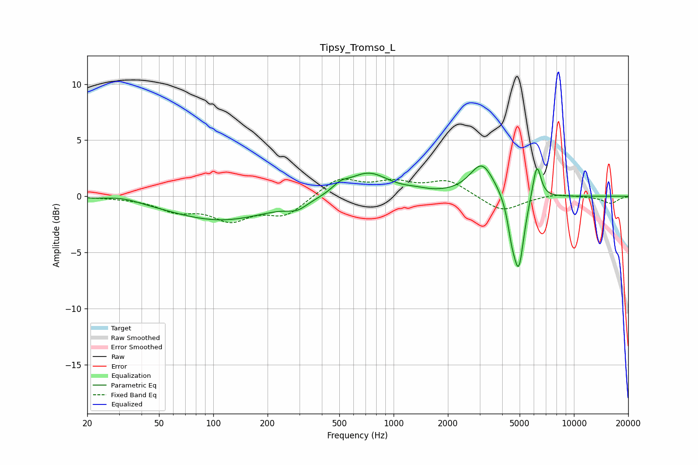

# Tipsy_Tromso_L
See [usage instructions](https://github.com/jaakkopasanen/AutoEq#usage) for more options and info.

### Parametric EQs
Apply preamp of -2.8 dB when using parametric equalizer.

|   # | Type    |   Fc (Hz) |    Q |   Gain (dB) |
|-----|---------|-----------|------|-------------|
|   1 | Peaking |        32 | 1.51 |         0.4 |
|   2 | Peaking |       110 | 0.5  |        -2.1 |
|   3 | Peaking |       292 | 2.56 |        -0.7 |
|   4 | Peaking |       506 | 3.24 |         0.6 |
|   5 | Peaking |       721 | 1.23 |         2.1 |
|   6 | Peaking |      1327 | 2.36 |         0.2 |
|   7 | Peaking |      3090 | 2.09 |         2.9 |
|   8 | Peaking |      4512 | 5.99 |        -2.1 |
|   9 | Peaking |      4945 | 4.75 |        -6.2 |
|  10 | Peaking |      6227 | 5.91 |         3.2 |

### Fixed Band EQs
When using fixed band (also called graphic) equalizer, apply preamp of **-1.6 dB** (if available) and set gains manually with these parameters.

|   # | Type    |   Fc (Hz) |    Q |   Gain (dB) |
|-----|---------|-----------|------|-------------|
|   1 | Peaking |        31 | 1.41 |        -0.1 |
|   2 | Peaking |        62 | 1.41 |        -1.1 |
|   3 | Peaking |       125 | 1.41 |        -1.9 |
|   4 | Peaking |       250 | 1.41 |        -1.6 |
|   5 | Peaking |       500 | 1.41 |         1.6 |
|   6 | Peaking |      1000 | 1.41 |         1.1 |
|   7 | Peaking |      2000 | 1.41 |         1.4 |
|   8 | Peaking |      4000 | 1.41 |        -1.4 |
|   9 | Peaking |      8000 | 1.41 |         0.3 |
|  10 | Peaking |     16000 | 1.41 |        -0.6 |

### Graphs

