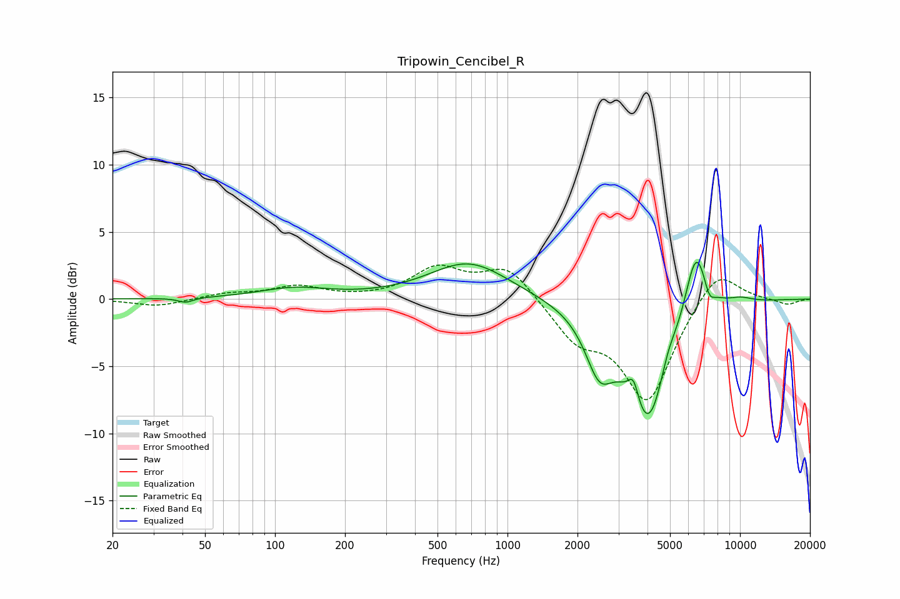

# Tripowin_Cencibel_R
See [usage instructions](https://github.com/jaakkopasanen/AutoEq#usage) for more options and info.

### Parametric EQs
Apply preamp of -2.8 dB when using parametric equalizer.

|   # | Type    |   Fc (Hz) |    Q |   Gain (dB) |
|-----|---------|-----------|------|-------------|
|   1 | Peaking |        41 | 4.42 |        -0.4 |
|   2 | Peaking |       121 | 0.95 |         0.8 |
|   3 | Peaking |       682 | 0.83 |         2.8 |
|   4 | Peaking |      2478 | 2.38 |        -3.8 |
|   5 | Peaking |      3483 | 6    |         1.9 |
|   6 | Peaking |      4039 | 1.47 |        -9.6 |
|   7 | Peaking |      4887 | 3.6  |         1.5 |
|   8 | Peaking |      6463 | 2.77 |         5.6 |
|   9 | Peaking |      7373 | 5.97 |        -1.1 |
|  10 | Peaking |     10000 | 2.23 |         0.4 |

### Fixed Band EQs
When using fixed band (also called graphic) equalizer, apply preamp of **-2.6 dB** (if available) and set gains manually with these parameters.

|   # | Type    |   Fc (Hz) |    Q |   Gain (dB) |
|-----|---------|-----------|------|-------------|
|   1 | Peaking |        31 | 1.41 |        -0.5 |
|   2 | Peaking |        62 | 1.41 |         0.4 |
|   3 | Peaking |       125 | 1.41 |         0.9 |
|   4 | Peaking |       250 | 1.41 |        -0   |
|   5 | Peaking |       500 | 1.41 |         2.2 |
|   6 | Peaking |      1000 | 1.41 |         2.4 |
|   7 | Peaking |      2000 | 1.41 |        -2.7 |
|   8 | Peaking |      4000 | 1.41 |        -7.5 |
|   9 | Peaking |      8000 | 1.41 |         2.6 |
|  10 | Peaking |     16000 | 1.41 |        -0.4 |

### Graphs

