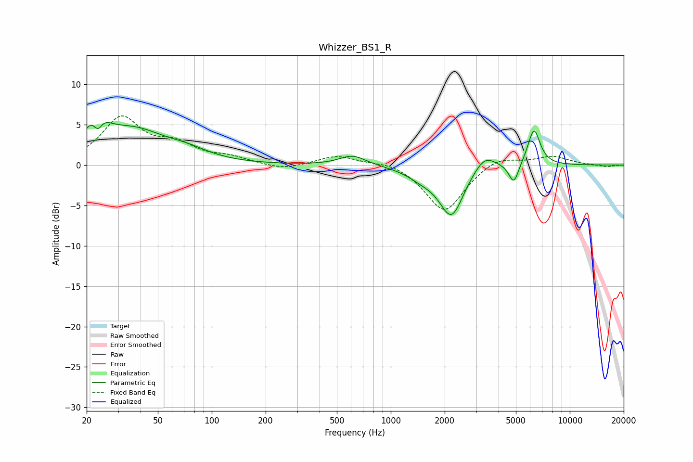

# Whizzer_BS1_R
See [usage instructions](https://github.com/jaakkopasanen/AutoEq#usage) for more options and info.

### Parametric EQs
Apply preamp of -5.4 dB when using parametric equalizer.

|   # | Type    |   Fc (Hz) |    Q |   Gain (dB) |
|-----|---------|-----------|------|-------------|
|   1 | Peaking |        23 | 2.49 |         4.7 |
|   2 | Peaking |        23 | 5.29 |        -2.7 |
|   3 | Peaking |        36 | 0.8  |         4   |
|   4 | Peaking |        73 | 1.13 |         1   |
|   5 | Peaking |       613 | 1.92 |         1.3 |
|   6 | Peaking |      1494 | 1.64 |        -1.1 |
|   7 | Peaking |      2184 | 2.08 |        -6.1 |
|   8 | Peaking |      3341 | 2.29 |         2   |
|   9 | Peaking |      4868 | 5.08 |        -2.6 |
|  10 | Peaking |      6305 | 4    |         4.5 |

### Fixed Band EQs
When using fixed band (also called graphic) equalizer, apply preamp of **-6.2 dB** (if available) and set gains manually with these parameters.

|   # | Type    |   Fc (Hz) |    Q |   Gain (dB) |
|-----|---------|-----------|------|-------------|
|   1 | Peaking |        31 | 1.41 |         5.7 |
|   2 | Peaking |        62 | 1.41 |         2.2 |
|   3 | Peaking |       125 | 1.41 |         0.8 |
|   4 | Peaking |       250 | 1.41 |        -0.7 |
|   5 | Peaking |       500 | 1.41 |         1.2 |
|   6 | Peaking |      1000 | 1.41 |         0.6 |
|   7 | Peaking |      2000 | 1.41 |        -5.9 |
|   8 | Peaking |      4000 | 1.41 |         1.3 |
|   9 | Peaking |      8000 | 1.41 |         1.1 |
|  10 | Peaking |     16000 | 1.41 |        -0.2 |

### Graphs

