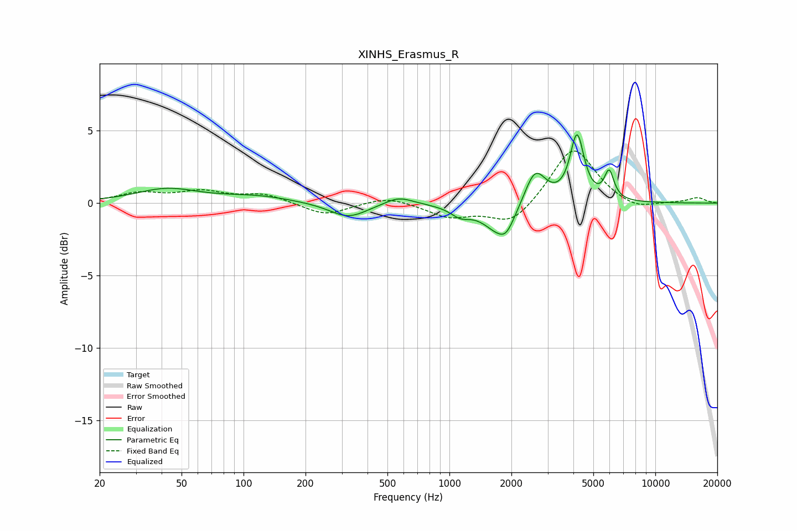

# XINHS_Erasmus_R
See [usage instructions](https://github.com/jaakkopasanen/AutoEq#usage) for more options and info.

### Parametric EQs
Apply preamp of -4.8 dB when using parametric equalizer.

|   # | Type    |   Fc (Hz) |    Q |   Gain (dB) |
|-----|---------|-----------|------|-------------|
|   1 | Peaking |        42 | 0.93 |         0.9 |
|   2 | Peaking |       116 | 0.83 |         0.4 |
|   3 | Peaking |       323 | 1.55 |        -1   |
|   4 | Peaking |       568 | 2.08 |         0.6 |
|   5 | Peaking |      1130 | 3    |        -0.6 |
|   6 | Peaking |      1772 | 1.79 |        -2.1 |
|   7 | Peaking |      1892 | 4.31 |        -0.6 |
|   8 | Peaking |      2604 | 2.71 |         2.5 |
|   9 | Peaking |      4167 | 4.24 |         4.5 |
|  10 | Peaking |      5968 | 6    |         1.9 |

### Fixed Band EQs
When using fixed band (also called graphic) equalizer, apply preamp of **-3.7 dB** (if available) and set gains manually with these parameters.

|   # | Type    |   Fc (Hz) |    Q |   Gain (dB) |
|-----|---------|-----------|------|-------------|
|   1 | Peaking |        31 | 1.41 |         0.6 |
|   2 | Peaking |        62 | 1.41 |         0.7 |
|   3 | Peaking |       125 | 1.41 |         0.6 |
|   4 | Peaking |       250 | 1.41 |        -0.9 |
|   5 | Peaking |       500 | 1.41 |         0.5 |
|   6 | Peaking |      1000 | 1.41 |        -0.9 |
|   7 | Peaking |      2000 | 1.41 |        -1.5 |
|   8 | Peaking |      4000 | 1.41 |         4   |
|   9 | Peaking |      8000 | 1.41 |        -0.6 |
|  10 | Peaking |     16000 | 1.41 |         0.4 |

### Graphs

