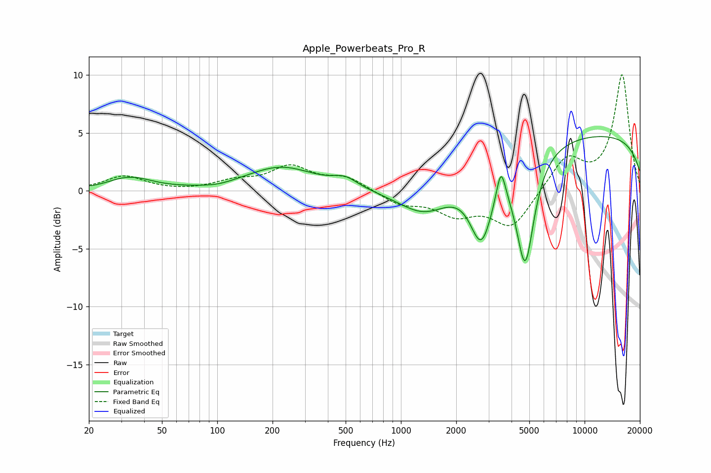

# Apple_Powerbeats_Pro_R
See [usage instructions](https://github.com/jaakkopasanen/AutoEq#usage) for more options and info.

### Parametric EQs
Apply preamp of -4.8 dB when using parametric equalizer.

|   # | Type    |   Fc (Hz) |    Q |   Gain (dB) |
|-----|---------|-----------|------|-------------|
|   1 | Peaking |        29 | 1.81 |         0.2 |
|   2 | Peaking |        35 | 1.24 |         1   |
|   3 | Peaking |       100 | 1.75 |        -0.2 |
|   4 | Peaking |       222 | 0.77 |         2   |
|   5 | Peaking |       497 | 2.13 |         0.8 |
|   6 | Peaking |      1357 | 0.95 |        -2.8 |
|   7 | Peaking |      2741 | 2.28 |        -5.9 |
|   8 | Peaking |      3504 | 5.8  |         2.9 |
|   9 | Peaking |      4748 | 2.8  |        -9.6 |
|  10 | Peaking |     10000 | 0.18 |         5   |

### Fixed Band EQs
When using fixed band (also called graphic) equalizer, apply preamp of **-10.1 dB** (if available) and set gains manually with these parameters.

|   # | Type    |   Fc (Hz) |    Q |   Gain (dB) |
|-----|---------|-----------|------|-------------|
|   1 | Peaking |        31 | 1.41 |         1.3 |
|   2 | Peaking |        62 | 1.41 |        -0.1 |
|   3 | Peaking |       125 | 1.41 |         0.7 |
|   4 | Peaking |       250 | 1.41 |         2   |
|   5 | Peaking |       500 | 1.41 |         1.1 |
|   6 | Peaking |      1000 | 1.41 |        -1.1 |
|   7 | Peaking |      2000 | 1.41 |        -1.8 |
|   8 | Peaking |      4000 | 1.41 |        -3.1 |
|   9 | Peaking |      8000 | 1.41 |         2.9 |
|  10 | Peaking |     16000 | 1.41 |        10   |

### Graphs

