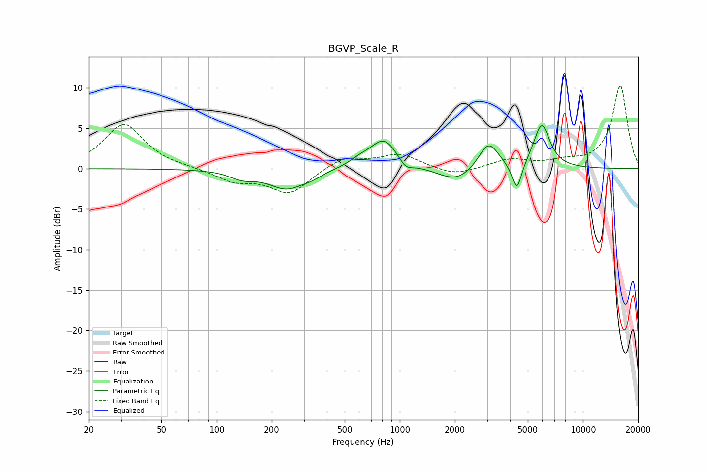

# BGVP_Scale_R
See [usage instructions](https://github.com/jaakkopasanen/AutoEq#usage) for more options and info.

### Parametric EQs
Apply preamp of -5.4 dB when using parametric equalizer.

|   # | Type    |   Fc (Hz) |    Q |   Gain (dB) |
|-----|---------|-----------|------|-------------|
|   1 | Peaking |       138 | 2.05 |        -0.9 |
|   2 | Peaking |       240 | 1.45 |        -2.4 |
|   3 | Peaking |       332 | 2.49 |        -0.5 |
|   4 | Peaking |       603 | 2.48 |         0.6 |
|   5 | Peaking |       822 | 1.85 |         3.7 |
|   6 | Peaking |      1075 | 3.62 |        -1.2 |
|   7 | Peaking |      2042 | 1.42 |        -1.8 |
|   8 | Peaking |      3048 | 2.57 |         3.5 |
|   9 | Peaking |      4356 | 5.29 |        -3.6 |
|  10 | Peaking |      5955 | 3.12 |         5.4 |

### Fixed Band EQs
When using fixed band (also called graphic) equalizer, apply preamp of **-10.4 dB** (if available) and set gains manually with these parameters.

|   # | Type    |   Fc (Hz) |    Q |   Gain (dB) |
|-----|---------|-----------|------|-------------|
|   1 | Peaking |        31 | 1.41 |         5.5 |
|   2 | Peaking |        62 | 1.41 |         0.1 |
|   3 | Peaking |       125 | 1.41 |        -1.5 |
|   4 | Peaking |       250 | 1.41 |        -3   |
|   5 | Peaking |       500 | 1.41 |         1.5 |
|   6 | Peaking |      1000 | 1.41 |         1.7 |
|   7 | Peaking |      2000 | 1.41 |        -1   |
|   8 | Peaking |      4000 | 1.41 |         1.1 |
|   9 | Peaking |      8000 | 1.41 |         0.7 |
|  10 | Peaking |     16000 | 1.41 |        10.3 |

### Graphs

