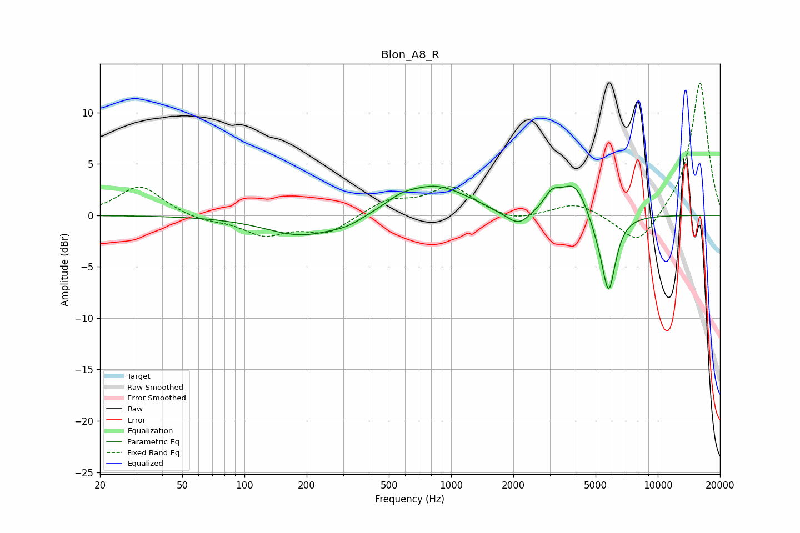

# Blon_A8_R
See [usage instructions](https://github.com/jaakkopasanen/AutoEq#usage) for more options and info.

### Parametric EQs
Apply preamp of -2.9 dB when using parametric equalizer.

|   # | Type    |   Fc (Hz) |    Q |   Gain (dB) |
|-----|---------|-----------|------|-------------|
|   1 | Peaking |       191 | 0.79 |        -2   |
|   2 | Peaking |       314 | 1.99 |        -0.5 |
|   3 | Peaking |       565 | 2.02 |         0.7 |
|   4 | Peaking |       836 | 0.89 |         2.9 |
|   5 | Peaking |      1806 | 2.11 |        -0.3 |
|   6 | Peaking |      2131 | 2.57 |        -1.4 |
|   7 | Peaking |      3077 | 3.7  |         1.4 |
|   8 | Peaking |      3976 | 2.03 |         3.4 |
|   9 | Peaking |      5145 | 2.42 |        -1.5 |
|  10 | Peaking |      5788 | 4.13 |        -7   |

### Fixed Band EQs
When using fixed band (also called graphic) equalizer, apply preamp of **-13.0 dB** (if available) and set gains manually with these parameters.

|   # | Type    |   Fc (Hz) |    Q |   Gain (dB) |
|-----|---------|-----------|------|-------------|
|   1 | Peaking |        31 | 1.41 |         2.9 |
|   2 | Peaking |        62 | 1.41 |        -0.5 |
|   3 | Peaking |       125 | 1.41 |        -1.8 |
|   4 | Peaking |       250 | 1.41 |        -1.7 |
|   5 | Peaking |       500 | 1.41 |         1.4 |
|   6 | Peaking |      1000 | 1.41 |         2.7 |
|   7 | Peaking |      2000 | 1.41 |        -0.7 |
|   8 | Peaking |      4000 | 1.41 |         1.3 |
|   9 | Peaking |      8000 | 1.41 |        -3.2 |
|  10 | Peaking |     16000 | 1.41 |        13.1 |

### Graphs

