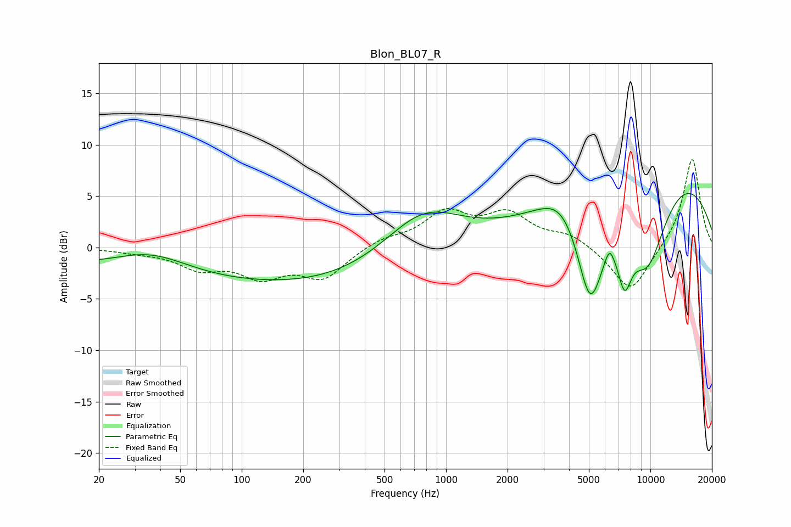

# Blon_BL07_R
See [usage instructions](https://github.com/jaakkopasanen/AutoEq#usage) for more options and info.

### Parametric EQs
Apply preamp of -5.3 dB when using parametric equalizer.

|   # | Type    |   Fc (Hz) |    Q |   Gain (dB) |
|-----|---------|-----------|------|-------------|
|   1 | Peaking |        36 | 0.72 |         2.5 |
|   2 | Peaking |        68 | 0.18 |        -3.4 |
|   3 | Peaking |       515 | 0.39 |        -1.8 |
|   4 | Peaking |       772 | 0.72 |         5   |
|   5 | Peaking |      3697 | 1.41 |         2.2 |
|   6 | Peaking |      5073 | 1.94 |       -10.4 |
|   7 | Peaking |      6297 | 6    |         1.4 |
|   8 | Peaking |      7476 | 3.77 |        -4.7 |
|   9 | Peaking |      9635 | 1.12 |        -9.5 |
|  10 | Peaking |     10000 | 0.27 |         9.1 |

### Fixed Band EQs
When using fixed band (also called graphic) equalizer, apply preamp of **-8.7 dB** (if available) and set gains manually with these parameters.

|   # | Type    |   Fc (Hz) |    Q |   Gain (dB) |
|-----|---------|-----------|------|-------------|
|   1 | Peaking |        31 | 1.41 |        -0.3 |
|   2 | Peaking |        62 | 1.41 |        -1.8 |
|   3 | Peaking |       125 | 1.41 |        -2.5 |
|   4 | Peaking |       250 | 1.41 |        -2.8 |
|   5 | Peaking |       500 | 1.41 |         0.8 |
|   6 | Peaking |      1000 | 1.41 |         3.2 |
|   7 | Peaking |      2000 | 1.41 |         3   |
|   8 | Peaking |      4000 | 1.41 |         1.2 |
|   9 | Peaking |      8000 | 1.41 |        -4.5 |
|  10 | Peaking |     16000 | 1.41 |         8.8 |

### Graphs

