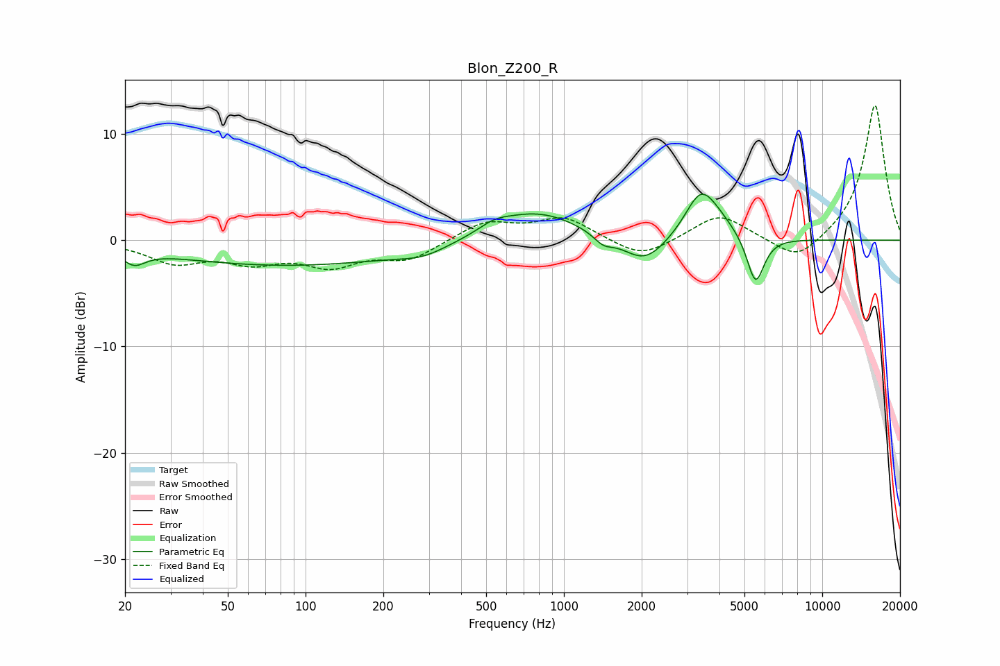

# Blon_Z200_R
See [usage instructions](https://github.com/jaakkopasanen/AutoEq#usage) for more options and info.

### Parametric EQs
Apply preamp of -4.4 dB when using parametric equalizer.

|   # | Type    |   Fc (Hz) |    Q |   Gain (dB) |
|-----|---------|-----------|------|-------------|
|   1 | Peaking |        22 | 3.27 |        -1.3 |
|   2 | Peaking |        87 | 0.29 |        -2.4 |
|   3 | Peaking |       284 | 1.53 |        -0.8 |
|   4 | Peaking |       537 | 2.36 |         0.7 |
|   5 | Peaking |       779 | 0.82 |         2.8 |
|   6 | Peaking |      1420 | 3.78 |        -0.9 |
|   7 | Peaking |      2051 | 1.63 |        -2.6 |
|   8 | Peaking |      3375 | 2.35 |         3.8 |
|   9 | Peaking |      3863 | 1.66 |         1.5 |
|  10 | Peaking |      5519 | 4.13 |        -4.6 |

### Fixed Band EQs
When using fixed band (also called graphic) equalizer, apply preamp of **-12.8 dB** (if available) and set gains manually with these parameters.

|   # | Type    |   Fc (Hz) |    Q |   Gain (dB) |
|-----|---------|-----------|------|-------------|
|   1 | Peaking |        31 | 1.41 |        -1.9 |
|   2 | Peaking |        62 | 1.41 |        -1.7 |
|   3 | Peaking |       125 | 1.41 |        -2.1 |
|   4 | Peaking |       250 | 1.41 |        -1.7 |
|   5 | Peaking |       500 | 1.41 |         1.7 |
|   6 | Peaking |      1000 | 1.41 |         2.1 |
|   7 | Peaking |      2000 | 1.41 |        -1.8 |
|   8 | Peaking |      4000 | 1.41 |         2.5 |
|   9 | Peaking |      8000 | 1.41 |        -2.2 |
|  10 | Peaking |     16000 | 1.41 |        12.9 |

### Graphs

