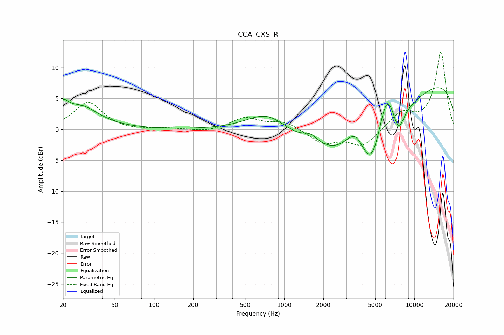

# CCA_CXS_R
See [usage instructions](https://github.com/jaakkopasanen/AutoEq#usage) for more options and info.

### Parametric EQs
Apply preamp of -6.8 dB when using parametric equalizer.

|   # | Type    |   Fc (Hz) |    Q |   Gain (dB) |
|-----|---------|-----------|------|-------------|
|   1 | Peaking |        20 | 3.48 |         2.3 |
|   2 | Peaking |        27 | 1.03 |         3.5 |
|   3 | Peaking |       748 | 0.86 |         3.8 |
|   4 | Peaking |      1590 | 2.51 |         1.4 |
|   5 | Peaking |      3533 | 1.75 |         4.5 |
|   6 | Peaking |      3729 | 0.34 |       -12.1 |
|   7 | Peaking |      4716 | 1.62 |        -7.2 |
|   8 | Peaking |      6110 | 1.87 |         8.4 |
|   9 | Peaking |      7536 | 2.97 |        -4.2 |
|  10 | Peaking |      9094 | 0.18 |        10.4 |

### Fixed Band EQs
When using fixed band (also called graphic) equalizer, apply preamp of **-12.7 dB** (if available) and set gains manually with these parameters.

|   # | Type    |   Fc (Hz) |    Q |   Gain (dB) |
|-----|---------|-----------|------|-------------|
|   1 | Peaking |        31 | 1.41 |         4.4 |
|   2 | Peaking |        62 | 1.41 |        -0.2 |
|   3 | Peaking |       125 | 1.41 |         0.2 |
|   4 | Peaking |       250 | 1.41 |        -0.4 |
|   5 | Peaking |       500 | 1.41 |         1.9 |
|   6 | Peaking |      1000 | 1.41 |         1.3 |
|   7 | Peaking |      2000 | 1.41 |        -2.2 |
|   8 | Peaking |      4000 | 1.41 |        -2.7 |
|   9 | Peaking |      8000 | 1.41 |         2.6 |
|  10 | Peaking |     16000 | 1.41 |        12.6 |

### Graphs

