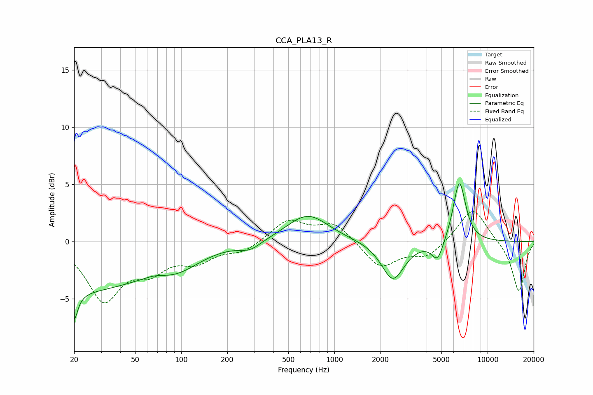

# CCA_PLA13_R
See [usage instructions](https://github.com/jaakkopasanen/AutoEq#usage) for more options and info.

### Parametric EQs
Apply preamp of -5.1 dB when using parametric equalizer.

|   # | Type    |   Fc (Hz) |    Q |   Gain (dB) |
|-----|---------|-----------|------|-------------|
|   1 | Peaking |        20 | 0.29 |        -4.2 |
|   2 | Peaking |        20 | 5.58 |        -4.2 |
|   3 | Peaking |        21 | 6    |         1.9 |
|   4 | Peaking |        68 | 1.97 |         0.3 |
|   5 | Peaking |        95 | 0.94 |        -1.3 |
|   6 | Peaking |       282 | 1.99 |        -0.7 |
|   7 | Peaking |       669 | 1.04 |         2.4 |
|   8 | Peaking |      2410 | 1.91 |        -3.4 |
|   9 | Peaking |      4721 | 3.61 |        -1.8 |
|  10 | Peaking |      6543 | 3.33 |         5.4 |

### Fixed Band EQs
When using fixed band (also called graphic) equalizer, apply preamp of **-2.7 dB** (if available) and set gains manually with these parameters.

|   # | Type    |   Fc (Hz) |    Q |   Gain (dB) |
|-----|---------|-----------|------|-------------|
|   1 | Peaking |        31 | 1.41 |        -4.9 |
|   2 | Peaking |        62 | 1.41 |        -2.1 |
|   3 | Peaking |       125 | 1.41 |        -1.5 |
|   4 | Peaking |       250 | 1.41 |        -0.8 |
|   5 | Peaking |       500 | 1.41 |         1.9 |
|   6 | Peaking |      1000 | 1.41 |         1.6 |
|   7 | Peaking |      2000 | 1.41 |        -2.3 |
|   8 | Peaking |      4000 | 1.41 |        -1.3 |
|   9 | Peaking |      8000 | 1.41 |         3.1 |
|  10 | Peaking |     16000 | 1.41 |        -4.4 |

### Graphs

