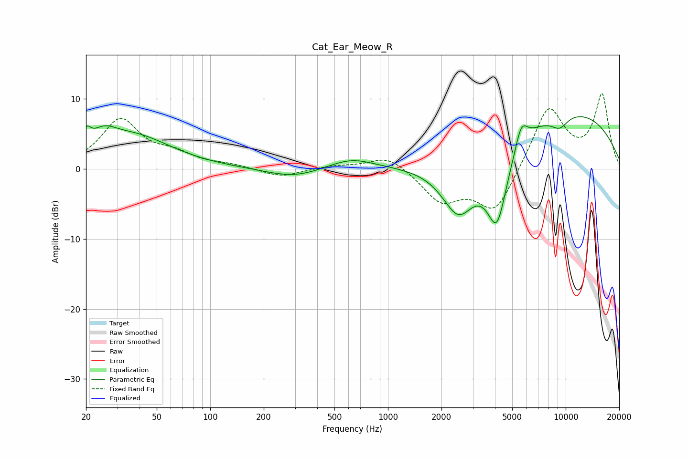

# Cat_Ear_Meow_R
See [usage instructions](https://github.com/jaakkopasanen/AutoEq#usage) for more options and info.

### Parametric EQs
Apply preamp of -7.5 dB when using parametric equalizer.

|   # | Type    |   Fc (Hz) |    Q |   Gain (dB) |
|-----|---------|-----------|------|-------------|
|   1 | Peaking |        20 | 6    |         2.1 |
|   2 | Peaking |        25 | 2    |         2.3 |
|   3 | Peaking |        37 | 0.66 |         4.6 |
|   4 | Peaking |       296 | 0.92 |        -1.3 |
|   5 | Peaking |       619 | 1.09 |         1.6 |
|   6 | Peaking |      2495 | 1.45 |        -7.8 |
|   7 | Peaking |      4104 | 2.27 |       -10.8 |
|   8 | Peaking |      5627 | 3.99 |         3.4 |
|   9 | Peaking |      9235 | 2.57 |        -1.8 |
|  10 | Peaking |     10000 | 0.3  |         8.3 |

### Fixed Band EQs
When using fixed band (also called graphic) equalizer, apply preamp of **-10.8 dB** (if available) and set gains manually with these parameters.

|   # | Type    |   Fc (Hz) |    Q |   Gain (dB) |
|-----|---------|-----------|------|-------------|
|   1 | Peaking |        31 | 1.41 |         6.9 |
|   2 | Peaking |        62 | 1.41 |         1.7 |
|   3 | Peaking |       125 | 1.41 |         0.5 |
|   4 | Peaking |       250 | 1.41 |        -1.2 |
|   5 | Peaking |       500 | 1.41 |         0.4 |
|   6 | Peaking |      1000 | 1.41 |         2.1 |
|   7 | Peaking |      2000 | 1.41 |        -4.4 |
|   8 | Peaking |      4000 | 1.41 |        -6.3 |
|   9 | Peaking |      8000 | 1.41 |         9   |
|  10 | Peaking |     16000 | 1.41 |        10.4 |

### Graphs

