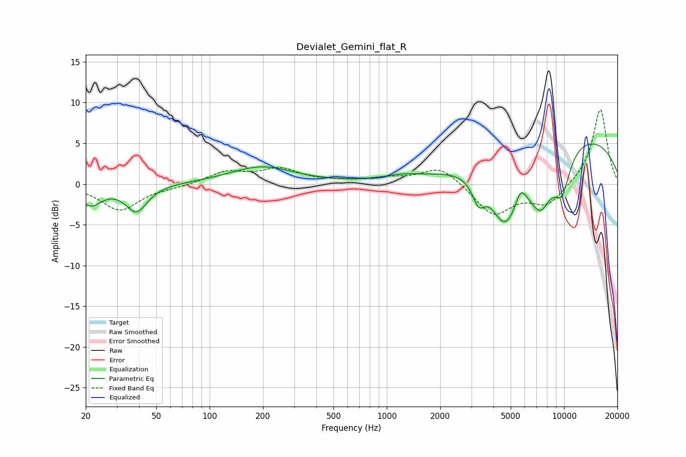

# Devialet_Gemini_flat_R
See [usage instructions](https://github.com/jaakkopasanen/AutoEq#usage) for more options and info.

### Parametric EQs
Apply preamp of -5.0 dB when using parametric equalizer.

|   # | Type    |   Fc (Hz) |    Q |   Gain (dB) |
|-----|---------|-----------|------|-------------|
|   1 | Peaking |        21 | 2.27 |        -2.4 |
|   2 | Peaking |        39 | 2.33 |        -3.3 |
|   3 | Peaking |       197 | 0.79 |         2.1 |
|   4 | Peaking |      1198 | 1.46 |         0.5 |
|   5 | Peaking |      3291 | 4.12 |        -2.7 |
|   6 | Peaking |      4667 | 1.56 |        -8.4 |
|   7 | Peaking |      5692 | 4.46 |         2   |
|   8 | Peaking |      7362 | 1.9  |        -6.1 |
|   9 | Peaking |      9719 | 2.53 |        -4.9 |
|  10 | Peaking |     10000 | 0.24 |         6.4 |

### Fixed Band EQs
When using fixed band (also called graphic) equalizer, apply preamp of **-9.2 dB** (if available) and set gains manually with these parameters.

|   # | Type    |   Fc (Hz) |    Q |   Gain (dB) |
|-----|---------|-----------|------|-------------|
|   1 | Peaking |        31 | 1.41 |        -3.2 |
|   2 | Peaking |        62 | 1.41 |        -0.3 |
|   3 | Peaking |       125 | 1.41 |         1.4 |
|   4 | Peaking |       250 | 1.41 |         1.7 |
|   5 | Peaking |       500 | 1.41 |         0.2 |
|   6 | Peaking |      1000 | 1.41 |         0.6 |
|   7 | Peaking |      2000 | 1.41 |         2.2 |
|   8 | Peaking |      4000 | 1.41 |        -3.8 |
|   9 | Peaking |      8000 | 1.41 |        -2.5 |
|  10 | Peaking |     16000 | 1.41 |         9.3 |

### Graphs

