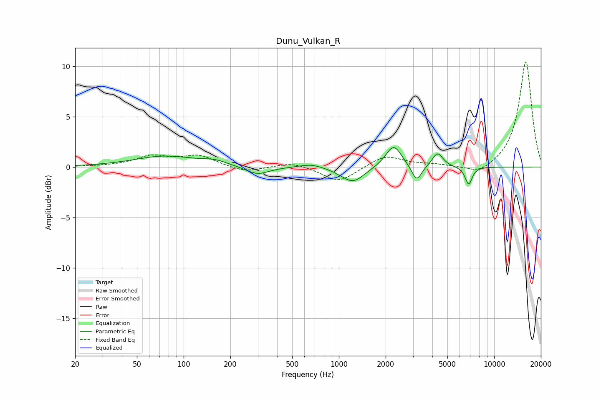

# Dunu_Vulkan_R
See [usage instructions](https://github.com/jaakkopasanen/AutoEq#usage) for more options and info.

### Parametric EQs
Apply preamp of -2.0 dB when using parametric equalizer.

|   # | Type    |   Fc (Hz) |    Q |   Gain (dB) |
|-----|---------|-----------|------|-------------|
|   1 | Peaking |        76 | 0.71 |         1.1 |
|   2 | Peaking |       159 | 1.88 |         0.4 |
|   3 | Peaking |       299 | 1.84 |        -0.8 |
|   4 | Peaking |       667 | 1.87 |         0.4 |
|   5 | Peaking |      1097 | 1.72 |        -0.3 |
|   6 | Peaking |      1245 | 2.02 |        -1.3 |
|   7 | Peaking |      2253 | 2.76 |         2.2 |
|   8 | Peaking |      3168 | 4.39 |        -1.6 |
|   9 | Peaking |      4325 | 4.12 |         1.4 |
|  10 | Peaking |      6851 | 6    |        -1.8 |

### Fixed Band EQs
When using fixed band (also called graphic) equalizer, apply preamp of **-10.5 dB** (if available) and set gains manually with these parameters.

|   # | Type    |   Fc (Hz) |    Q |   Gain (dB) |
|-----|---------|-----------|------|-------------|
|   1 | Peaking |        31 | 1.41 |         0   |
|   2 | Peaking |        62 | 1.41 |         1   |
|   3 | Peaking |       125 | 1.41 |         1.1 |
|   4 | Peaking |       250 | 1.41 |        -0.6 |
|   5 | Peaking |       500 | 1.41 |         0.5 |
|   6 | Peaking |      1000 | 1.41 |        -1.5 |
|   7 | Peaking |      2000 | 1.41 |         1.2 |
|   8 | Peaking |      4000 | 1.41 |         0.2 |
|   9 | Peaking |      8000 | 1.41 |        -0.9 |
|  10 | Peaking |     16000 | 1.41 |        10.5 |

### Graphs

