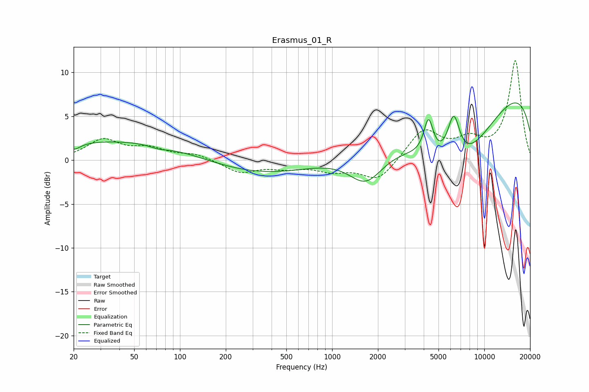

# Erasmus_01_R
See [usage instructions](https://github.com/jaakkopasanen/AutoEq#usage) for more options and info.

### Parametric EQs
Apply preamp of -6.6 dB when using parametric equalizer.

|   # | Type    |   Fc (Hz) |    Q |   Gain (dB) |
|-----|---------|-----------|------|-------------|
|   1 | Peaking |        20 | 3.3  |        -0.8 |
|   2 | Peaking |        25 | 0.23 |         1.9 |
|   3 | Peaking |        73 | 2.18 |        -0.4 |
|   4 | Peaking |       247 | 0.18 |         1.1 |
|   5 | Peaking |       350 | 0.37 |        -2.6 |
|   6 | Peaking |      1669 | 1.23 |        -3.8 |
|   7 | Peaking |      4300 | 4.55 |         4.1 |
|   8 | Peaking |      6291 | 3.3  |         5.3 |
|   9 | Peaking |      6569 | 0.48 |       -10.3 |
|  10 | Peaking |      9933 | 0.19 |        10.6 |

### Fixed Band EQs
When using fixed band (also called graphic) equalizer, apply preamp of **-11.4 dB** (if available) and set gains manually with these parameters.

|   # | Type    |   Fc (Hz) |    Q |   Gain (dB) |
|-----|---------|-----------|------|-------------|
|   1 | Peaking |        31 | 1.41 |         2.2 |
|   2 | Peaking |        62 | 1.41 |         1.2 |
|   3 | Peaking |       125 | 1.41 |         0.7 |
|   4 | Peaking |       250 | 1.41 |        -1.4 |
|   5 | Peaking |       500 | 1.41 |        -0.7 |
|   6 | Peaking |      1000 | 1.41 |        -1.1 |
|   7 | Peaking |      2000 | 1.41 |        -2.4 |
|   8 | Peaking |      4000 | 1.41 |         3.5 |
|   9 | Peaking |      8000 | 1.41 |         1.9 |
|  10 | Peaking |     16000 | 1.41 |        11.3 |

### Graphs

