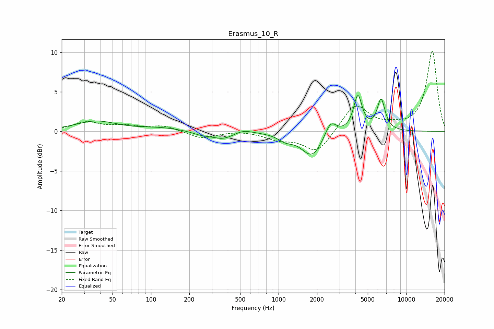

# Erasmus_10_R
See [usage instructions](https://github.com/jaakkopasanen/AutoEq#usage) for more options and info.

### Parametric EQs
Apply preamp of -4.7 dB when using parametric equalizer.

|   # | Type    |   Fc (Hz) |    Q |   Gain (dB) |
|-----|---------|-----------|------|-------------|
|   1 | Peaking |        37 | 0.9  |         1.3 |
|   2 | Peaking |       121 | 0.84 |         0.4 |
|   3 | Peaking |       250 | 1.86 |        -0.4 |
|   4 | Peaking |       368 | 1.65 |        -0.9 |
|   5 | Peaking |       528 | 2.11 |         0.5 |
|   6 | Peaking |      1134 | 2.46 |        -0.8 |
|   7 | Peaking |      1832 | 1.69 |        -3.2 |
|   8 | Peaking |      2554 | 3.17 |         2   |
|   9 | Peaking |      4184 | 4.23 |         4.5 |
|  10 | Peaking |      6361 | 4.44 |         3.9 |

### Fixed Band EQs
When using fixed band (also called graphic) equalizer, apply preamp of **-10.3 dB** (if available) and set gains manually with these parameters.

|   # | Type    |   Fc (Hz) |    Q |   Gain (dB) |
|-----|---------|-----------|------|-------------|
|   1 | Peaking |        31 | 1.41 |         1.1 |
|   2 | Peaking |        62 | 1.41 |         0.6 |
|   3 | Peaking |       125 | 1.41 |         0.7 |
|   4 | Peaking |       250 | 1.41 |        -0.9 |
|   5 | Peaking |       500 | 1.41 |         0.2 |
|   6 | Peaking |      1000 | 1.41 |        -0.9 |
|   7 | Peaking |      2000 | 1.41 |        -2.7 |
|   8 | Peaking |      4000 | 1.41 |         3.5 |
|   9 | Peaking |      8000 | 1.41 |         0.5 |
|  10 | Peaking |     16000 | 1.41 |        10.2 |

### Graphs

