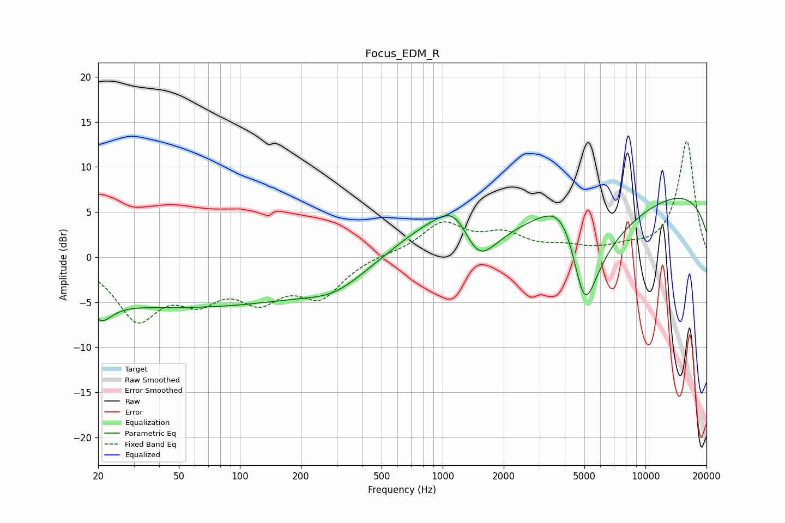

# Focus_EDM_R
See [usage instructions](https://github.com/jaakkopasanen/AutoEq#usage) for more options and info.

### Parametric EQs
Apply preamp of -6.6 dB when using parametric equalizer.

|   # | Type    |   Fc (Hz) |    Q |   Gain (dB) |
|-----|---------|-----------|------|-------------|
|   1 | Peaking |        20 | 3.6  |         3.1 |
|   2 | Peaking |        21 | 3.12 |        -5.4 |
|   3 | Peaking |        52 | 0.18 |        -5.5 |
|   4 | Peaking |       294 | 0.99 |        -1.8 |
|   5 | Peaking |       815 | 0.81 |         2.7 |
|   6 | Peaking |      1155 | 1.6  |         3.8 |
|   7 | Peaking |      1493 | 1.67 |        -4.4 |
|   8 | Peaking |      4108 | 1    |        10.6 |
|   9 | Peaking |      4981 | 1.15 |       -20   |
|  10 | Peaking |     10000 | 0.18 |         8.1 |

### Fixed Band EQs
When using fixed band (also called graphic) equalizer, apply preamp of **-12.9 dB** (if available) and set gains manually with these parameters.

|   # | Type    |   Fc (Hz) |    Q |   Gain (dB) |
|-----|---------|-----------|------|-------------|
|   1 | Peaking |        31 | 1.41 |        -6.4 |
|   2 | Peaking |        62 | 1.41 |        -3.7 |
|   3 | Peaking |       125 | 1.41 |        -3.9 |
|   4 | Peaking |       250 | 1.41 |        -4   |
|   5 | Peaking |       500 | 1.41 |         0.3 |
|   6 | Peaking |      1000 | 1.41 |         3.6 |
|   7 | Peaking |      2000 | 1.41 |         2.2 |
|   8 | Peaking |      4000 | 1.41 |         0.8 |
|   9 | Peaking |      8000 | 1.41 |         0.8 |
|  10 | Peaking |     16000 | 1.41 |        12.9 |

### Graphs

