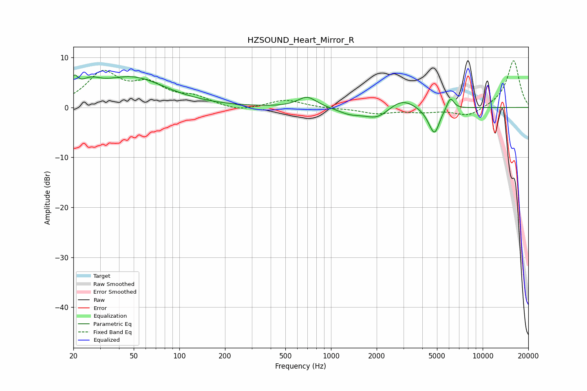

# HZSOUND_Heart_Mirror_R
See [usage instructions](https://github.com/jaakkopasanen/AutoEq#usage) for more options and info.

### Parametric EQs
Apply preamp of -6.6 dB when using parametric equalizer.

|   # | Type    |   Fc (Hz) |    Q |   Gain (dB) |
|-----|---------|-----------|------|-------------|
|   1 | Peaking |        20 | 5.96 |         2.9 |
|   2 | Peaking |        26 | 2.09 |         2.4 |
|   3 | Peaking |        49 | 0.63 |         5.8 |
|   4 | Peaking |       696 | 2.29 |         2.2 |
|   5 | Peaking |      1336 | 1.79 |        -1.2 |
|   6 | Peaking |      2012 | 1.76 |        -2.2 |
|   7 | Peaking |      2932 | 1.67 |         2.1 |
|   8 | Peaking |      4580 | 2.98 |        -1.7 |
|   9 | Peaking |      4838 | 4.47 |        -3.9 |
|  10 | Peaking |      6125 | 5.88 |         2.5 |

### Fixed Band EQs
When using fixed band (also called graphic) equalizer, apply preamp of **-9.4 dB** (if available) and set gains manually with these parameters.

|   # | Type    |   Fc (Hz) |    Q |   Gain (dB) |
|-----|---------|-----------|------|-------------|
|   1 | Peaking |        31 | 1.41 |         6.6 |
|   2 | Peaking |        62 | 1.41 |         4   |
|   3 | Peaking |       125 | 1.41 |         1.8 |
|   4 | Peaking |       250 | 1.41 |        -0.9 |
|   5 | Peaking |       500 | 1.41 |         1.5 |
|   6 | Peaking |      1000 | 1.41 |        -0.2 |
|   7 | Peaking |      2000 | 1.41 |        -1.1 |
|   8 | Peaking |      4000 | 1.41 |        -0.8 |
|   9 | Peaking |      8000 | 1.41 |        -1.8 |
|  10 | Peaking |     16000 | 1.41 |         9.5 |

### Graphs

