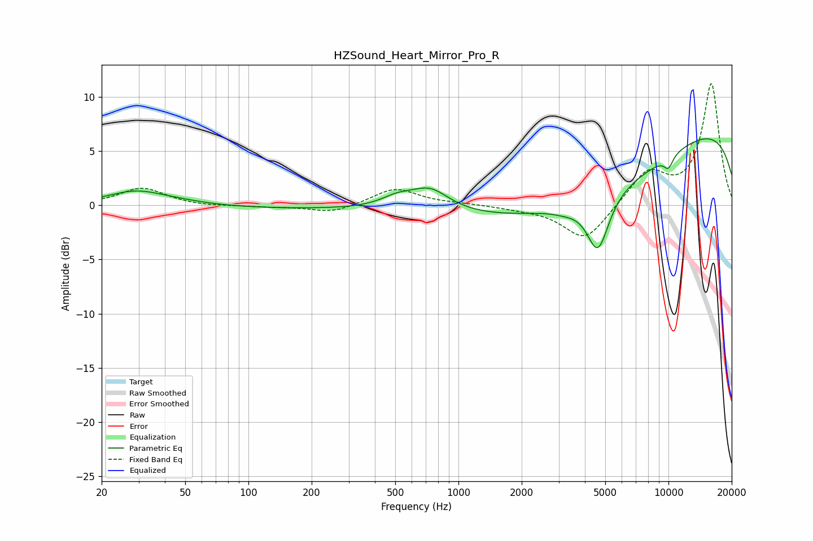

# HZSound_Heart_Mirror_Pro_R
See [usage instructions](https://github.com/jaakkopasanen/AutoEq#usage) for more options and info.

### Parametric EQs
Apply preamp of -6.2 dB when using parametric equalizer.

|   # | Type    |   Fc (Hz) |    Q |   Gain (dB) |
|-----|---------|-----------|------|-------------|
|   1 | Peaking |        29 | 1.08 |         1.2 |
|   2 | Peaking |        46 | 1.01 |         0.3 |
|   3 | Peaking |       248 | 0.22 |        -0.3 |
|   4 | Peaking |       513 | 1.77 |         0.9 |
|   5 | Peaking |       734 | 1.57 |         1.9 |
|   6 | Peaking |      3206 | 2.18 |        -0.4 |
|   7 | Peaking |      4236 | 0.31 |        -5.8 |
|   8 | Peaking |      4613 | 2.68 |        -5.1 |
|   9 | Peaking |     10000 | 5.54 |        -1.1 |
|  10 | Peaking |     10000 | 0.18 |         8.4 |

### Fixed Band EQs
When using fixed band (also called graphic) equalizer, apply preamp of **-11.3 dB** (if available) and set gains manually with these parameters.

|   # | Type    |   Fc (Hz) |    Q |   Gain (dB) |
|-----|---------|-----------|------|-------------|
|   1 | Peaking |        31 | 1.41 |         1.6 |
|   2 | Peaking |        62 | 1.41 |        -0.1 |
|   3 | Peaking |       125 | 1.41 |        -0.1 |
|   4 | Peaking |       250 | 1.41 |        -0.7 |
|   5 | Peaking |       500 | 1.41 |         1.6 |
|   6 | Peaking |      1000 | 1.41 |         0.1 |
|   7 | Peaking |      2000 | 1.41 |        -0.2 |
|   8 | Peaking |      4000 | 1.41 |        -3.3 |
|   9 | Peaking |      8000 | 1.41 |         3   |
|  10 | Peaking |     16000 | 1.41 |        11.2 |

### Graphs

