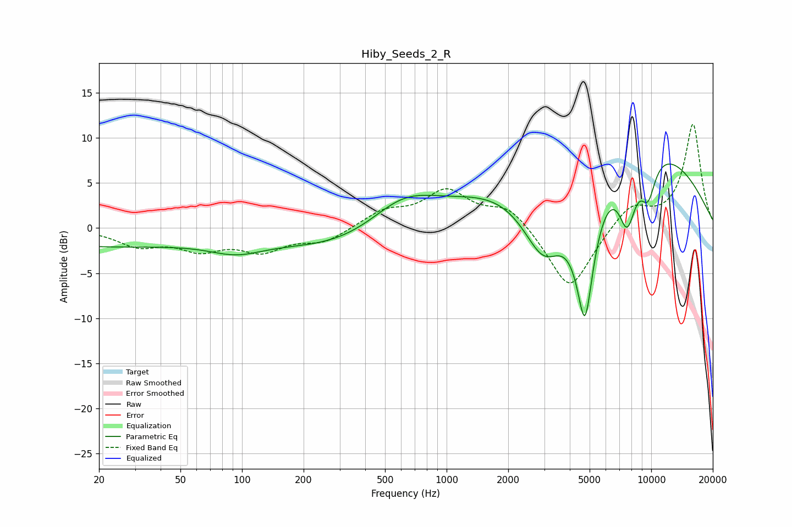

# Hiby_Seeds_2_R
See [usage instructions](https://github.com/jaakkopasanen/AutoEq#usage) for more options and info.

### Parametric EQs
Apply preamp of -7.2 dB when using parametric equalizer.

|   # | Type    |   Fc (Hz) |    Q |   Gain (dB) |
|-----|---------|-----------|------|-------------|
|   1 | Peaking |        20 | 0.27 |        -2   |
|   2 | Peaking |        94 | 1.06 |        -1.5 |
|   3 | Peaking |       348 | 0.42 |        -2.7 |
|   4 | Peaking |       611 | 0.81 |         4.1 |
|   5 | Peaking |      2987 | 1.07 |       -11.1 |
|   6 | Peaking |      4431 | 0.29 |         5.5 |
|   7 | Peaking |      4746 | 2.64 |       -16.2 |
|   8 | Peaking |      6996 | 0.23 |         7.2 |
|   9 | Peaking |      7633 | 2.89 |        -7.1 |
|  10 | Peaking |      9650 | 3.27 |        -4.4 |

### Fixed Band EQs
When using fixed band (also called graphic) equalizer, apply preamp of **-11.6 dB** (if available) and set gains manually with these parameters.

|   # | Type    |   Fc (Hz) |    Q |   Gain (dB) |
|-----|---------|-----------|------|-------------|
|   1 | Peaking |        31 | 1.41 |        -1.8 |
|   2 | Peaking |        62 | 1.41 |        -2.1 |
|   3 | Peaking |       125 | 1.41 |        -2.3 |
|   4 | Peaking |       250 | 1.41 |        -1.5 |
|   5 | Peaking |       500 | 1.41 |         1.7 |
|   6 | Peaking |      1000 | 1.41 |         3.9 |
|   7 | Peaking |      2000 | 1.41 |         2.4 |
|   8 | Peaking |      4000 | 1.41 |        -7.1 |
|   9 | Peaking |      8000 | 1.41 |         2.6 |
|  10 | Peaking |     16000 | 1.41 |        11.5 |

### Graphs

