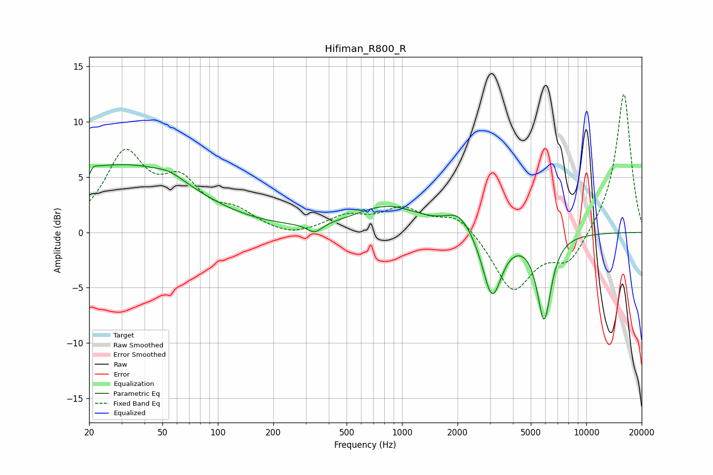

# Hifiman_R800_R
See [usage instructions](https://github.com/jaakkopasanen/AutoEq#usage) for more options and info.

### Parametric EQs
Apply preamp of -6.2 dB when using parametric equalizer.

|   # | Type    |   Fc (Hz) |    Q |   Gain (dB) |
|-----|---------|-----------|------|-------------|
|   1 | Peaking |        20 | 5.98 |        -3.8 |
|   2 | Peaking |        20 | 5.95 |         3.3 |
|   3 | Peaking |        22 | 0.32 |         5.3 |
|   4 | Peaking |        50 | 0.56 |         1.3 |
|   5 | Peaking |        55 | 1.97 |         0.5 |
|   6 | Peaking |       335 | 3.43 |        -0.9 |
|   7 | Peaking |       836 | 0.79 |         2.3 |
|   8 | Peaking |      2046 | 1.94 |         1.7 |
|   9 | Peaking |      3084 | 2.72 |        -6   |
|  10 | Peaking |      5905 | 3.62 |        -7.6 |

### Fixed Band EQs
When using fixed band (also called graphic) equalizer, apply preamp of **-12.6 dB** (if available) and set gains manually with these parameters.

|   # | Type    |   Fc (Hz) |    Q |   Gain (dB) |
|-----|---------|-----------|------|-------------|
|   1 | Peaking |        31 | 1.41 |         6.7 |
|   2 | Peaking |        62 | 1.41 |         3.9 |
|   3 | Peaking |       125 | 1.41 |         1.5 |
|   4 | Peaking |       250 | 1.41 |        -0.6 |
|   5 | Peaking |       500 | 1.41 |         1.3 |
|   6 | Peaking |      1000 | 1.41 |         2   |
|   7 | Peaking |      2000 | 1.41 |         1.7 |
|   8 | Peaking |      4000 | 1.41 |        -5.3 |
|   9 | Peaking |      8000 | 1.41 |        -2.7 |
|  10 | Peaking |     16000 | 1.41 |        12.7 |

### Graphs

