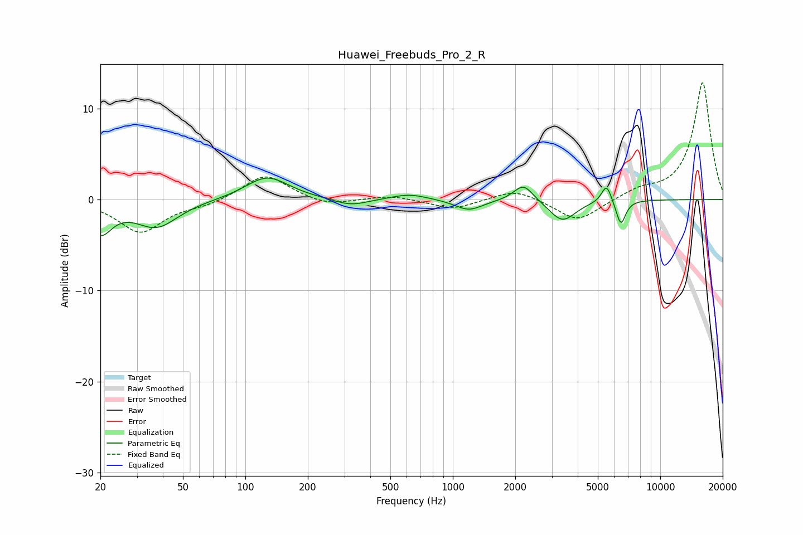

# Huawei_Freebuds_Pro_2_R
See [usage instructions](https://github.com/jaakkopasanen/AutoEq#usage) for more options and info.

### Parametric EQs
Apply preamp of -2.4 dB when using parametric equalizer.

|   # | Type    |   Fc (Hz) |    Q |   Gain (dB) |
|-----|---------|-----------|------|-------------|
|   1 | Peaking |        20 | 2.58 |        -3.3 |
|   2 | Peaking |        37 | 1.37 |        -2.9 |
|   3 | Peaking |       127 | 1.36 |         2.6 |
|   4 | Peaking |       322 | 1.71 |        -0.8 |
|   5 | Peaking |       616 | 1.62 |         0.6 |
|   6 | Peaking |      1193 | 2.12 |        -1.2 |
|   7 | Peaking |      2193 | 2.99 |         1.9 |
|   8 | Peaking |      3379 | 2.23 |        -2.4 |
|   9 | Peaking |      5511 | 5.79 |         2.1 |
|  10 | Peaking |      6458 | 6    |        -2.7 |

### Fixed Band EQs
When using fixed band (also called graphic) equalizer, apply preamp of **-12.9 dB** (if available) and set gains manually with these parameters.

|   # | Type    |   Fc (Hz) |    Q |   Gain (dB) |
|-----|---------|-----------|------|-------------|
|   1 | Peaking |        31 | 1.41 |        -3.6 |
|   2 | Peaking |        62 | 1.41 |        -0.6 |
|   3 | Peaking |       125 | 1.41 |         2.8 |
|   4 | Peaking |       250 | 1.41 |        -0.8 |
|   5 | Peaking |       500 | 1.41 |         0.5 |
|   6 | Peaking |      1000 | 1.41 |        -1.1 |
|   7 | Peaking |      2000 | 1.41 |         1.2 |
|   8 | Peaking |      4000 | 1.41 |        -2.5 |
|   9 | Peaking |      8000 | 1.41 |         0.9 |
|  10 | Peaking |     16000 | 1.41 |        12.9 |

### Graphs

