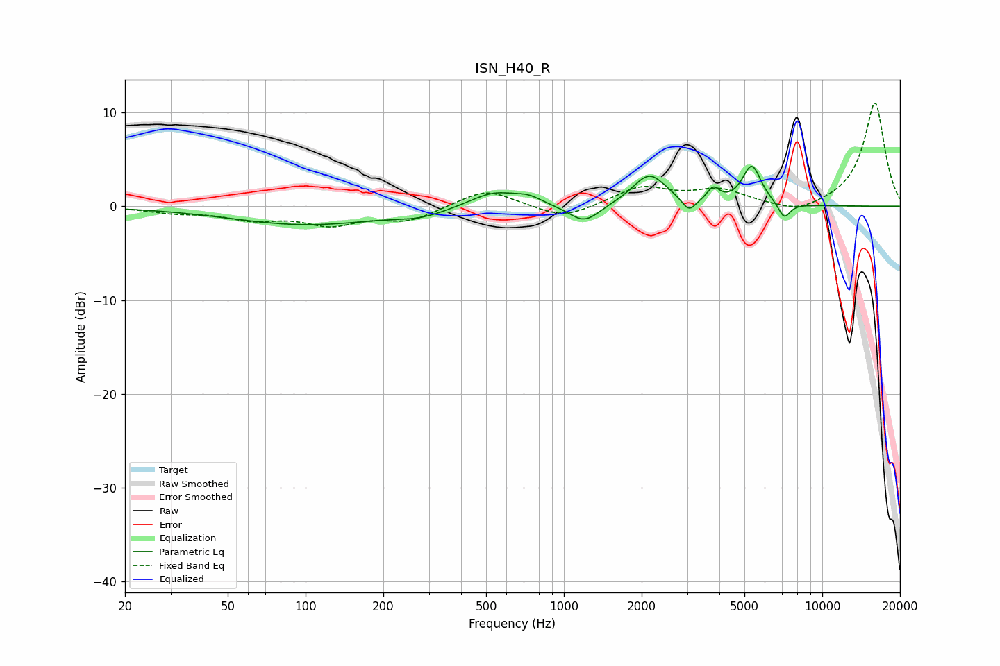

# ISN_H40_R
See [usage instructions](https://github.com/jaakkopasanen/AutoEq#usage) for more options and info.

### Parametric EQs
Apply preamp of -4.4 dB when using parametric equalizer.

|   # | Type    |   Fc (Hz) |    Q |   Gain (dB) |
|-----|---------|-----------|------|-------------|
|   1 | Peaking |       101 | 0.48 |        -1.9 |
|   2 | Peaking |       280 | 1.49 |        -0.7 |
|   3 | Peaking |       536 | 1.49 |         1.7 |
|   4 | Peaking |       731 | 2.78 |         0.7 |
|   5 | Peaking |      1200 | 2.36 |        -2   |
|   6 | Peaking |      2143 | 2.18 |         3.4 |
|   7 | Peaking |      3048 | 5.28 |        -1.4 |
|   8 | Peaking |      3785 | 6    |         1.4 |
|   9 | Peaking |      5337 | 3.83 |         4.2 |
|  10 | Peaking |      7129 | 5.81 |        -1.7 |

### Fixed Band EQs
When using fixed band (also called graphic) equalizer, apply preamp of **-11.1 dB** (if available) and set gains manually with these parameters.

|   # | Type    |   Fc (Hz) |    Q |   Gain (dB) |
|-----|---------|-----------|------|-------------|
|   1 | Peaking |        31 | 1.41 |        -0.6 |
|   2 | Peaking |        62 | 1.41 |        -1.2 |
|   3 | Peaking |       125 | 1.41 |        -1.8 |
|   4 | Peaking |       250 | 1.41 |        -1.5 |
|   5 | Peaking |       500 | 1.41 |         1.9 |
|   6 | Peaking |      1000 | 1.41 |        -1.4 |
|   7 | Peaking |      2000 | 1.41 |         2   |
|   8 | Peaking |      4000 | 1.41 |         1.6 |
|   9 | Peaking |      8000 | 1.41 |        -1   |
|  10 | Peaking |     16000 | 1.41 |        11.1 |

### Graphs

