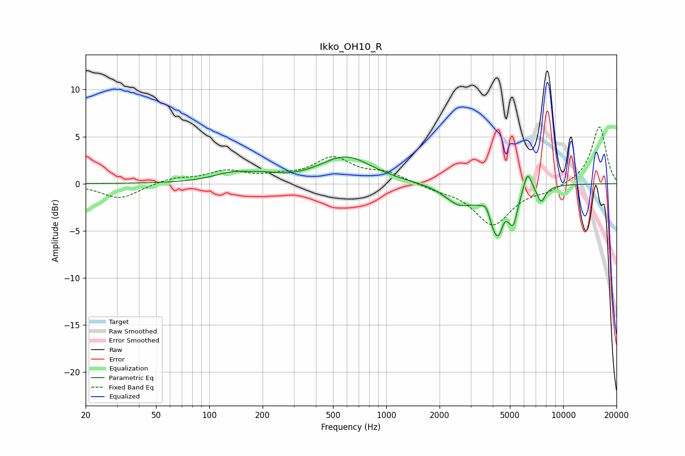

# Ikko_OH10_R
See [usage instructions](https://github.com/jaakkopasanen/AutoEq#usage) for more options and info.

### Parametric EQs
Apply preamp of -2.9 dB when using parametric equalizer.

|   # | Type    |   Fc (Hz) |    Q |   Gain (dB) |
|-----|---------|-----------|------|-------------|
|   1 | Peaking |       138 | 1.24 |         1   |
|   2 | Peaking |       207 | 1.95 |         0.4 |
|   3 | Peaking |       591 | 0.97 |         2.8 |
|   4 | Peaking |      2570 | 1.75 |        -1.9 |
|   5 | Peaking |      3681 | 6    |         1.1 |
|   6 | Peaking |      4296 | 2.74 |        -5.9 |
|   7 | Peaking |      4627 | 6    |         1.4 |
|   8 | Peaking |      5222 | 6    |        -2.4 |
|   9 | Peaking |      6284 | 5.95 |         2.3 |
|  10 | Peaking |      7519 | 5.9  |        -1.6 |

### Fixed Band EQs
When using fixed band (also called graphic) equalizer, apply preamp of **-6.1 dB** (if available) and set gains manually with these parameters.

|   # | Type    |   Fc (Hz) |    Q |   Gain (dB) |
|-----|---------|-----------|------|-------------|
|   1 | Peaking |        31 | 1.41 |        -1.6 |
|   2 | Peaking |        62 | 1.41 |         0.6 |
|   3 | Peaking |       125 | 1.41 |         1.2 |
|   4 | Peaking |       250 | 1.41 |         0.6 |
|   5 | Peaking |       500 | 1.41 |         2.6 |
|   6 | Peaking |      1000 | 1.41 |         1.1 |
|   7 | Peaking |      2000 | 1.41 |        -0.5 |
|   8 | Peaking |      4000 | 1.41 |        -4.3 |
|   9 | Peaking |      8000 | 1.41 |        -0.7 |
|  10 | Peaking |     16000 | 1.41 |         6.1 |

### Graphs

