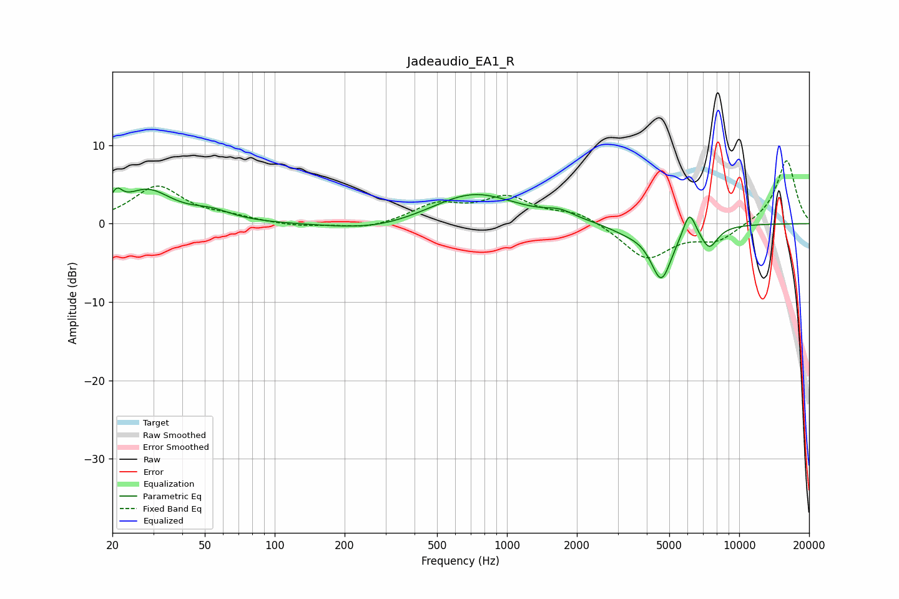

# Jadeaudio_EA1_R
See [usage instructions](https://github.com/jaakkopasanen/AutoEq#usage) for more options and info.

### Parametric EQs
Apply preamp of -4.6 dB when using parametric equalizer.

|   # | Type    |   Fc (Hz) |    Q |   Gain (dB) |
|-----|---------|-----------|------|-------------|
|   1 | Peaking |        21 | 5.84 |         2   |
|   2 | Peaking |        28 | 1.34 |         4.1 |
|   3 | Peaking |        53 | 1.63 |         1.1 |
|   4 | Peaking |       274 | 0.73 |        -1.1 |
|   5 | Peaking |       718 | 0.77 |         4   |
|   6 | Peaking |      1691 | 2.3  |         0.9 |
|   7 | Peaking |      3278 | 1.68 |        -0.8 |
|   8 | Peaking |      4621 | 2.97 |        -6.9 |
|   9 | Peaking |      6103 | 5.12 |         3.2 |
|  10 | Peaking |      7430 | 3.64 |        -2.8 |

### Fixed Band EQs
When using fixed band (also called graphic) equalizer, apply preamp of **-8.1 dB** (if available) and set gains manually with these parameters.

|   # | Type    |   Fc (Hz) |    Q |   Gain (dB) |
|-----|---------|-----------|------|-------------|
|   1 | Peaking |        31 | 1.41 |         4.7 |
|   2 | Peaking |        62 | 1.41 |         0.7 |
|   3 | Peaking |       125 | 1.41 |        -0.4 |
|   4 | Peaking |       250 | 1.41 |        -0.7 |
|   5 | Peaking |       500 | 1.41 |         2.3 |
|   6 | Peaking |      1000 | 1.41 |         3.1 |
|   7 | Peaking |      2000 | 1.41 |         1.4 |
|   8 | Peaking |      4000 | 1.41 |        -4.5 |
|   9 | Peaking |      8000 | 1.41 |        -2.1 |
|  10 | Peaking |     16000 | 1.41 |         8.2 |

### Graphs

