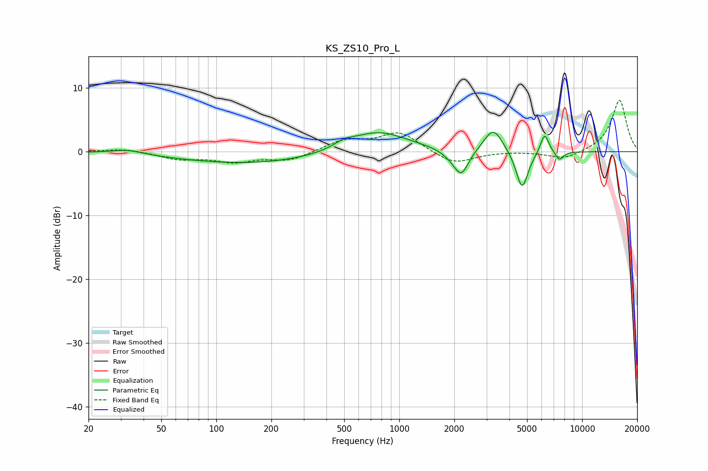

# KS_ZS10_Pro_L
See [usage instructions](https://github.com/jaakkopasanen/AutoEq#usage) for more options and info.

### Parametric EQs
Apply preamp of -3.1 dB when using parametric equalizer.

|   # | Type    |   Fc (Hz) |    Q |   Gain (dB) |
|-----|---------|-----------|------|-------------|
|   1 | Peaking |        33 | 1.67 |         0.7 |
|   2 | Peaking |       158 | 0.34 |        -1.9 |
|   3 | Peaking |       498 | 2.81 |         0.8 |
|   4 | Peaking |       755 | 0.85 |         3.4 |
|   5 | Peaking |      1959 | 2.6  |        -0.9 |
|   6 | Peaking |      2189 | 3.59 |        -3.6 |
|   7 | Peaking |      3269 | 2.77 |         3.8 |
|   8 | Peaking |      4695 | 4.2  |        -6.1 |
|   9 | Peaking |      6241 | 5.96 |         3.2 |
|  10 | Peaking |      7503 | 6    |        -1.4 |

### Fixed Band EQs
When using fixed band (also called graphic) equalizer, apply preamp of **-8.1 dB** (if available) and set gains manually with these parameters.

|   # | Type    |   Fc (Hz) |    Q |   Gain (dB) |
|-----|---------|-----------|------|-------------|
|   1 | Peaking |        31 | 1.41 |         0.5 |
|   2 | Peaking |        62 | 1.41 |        -1.1 |
|   3 | Peaking |       125 | 1.41 |        -1.4 |
|   4 | Peaking |       250 | 1.41 |        -1.4 |
|   5 | Peaking |       500 | 1.41 |         1.7 |
|   6 | Peaking |      1000 | 1.41 |         3   |
|   7 | Peaking |      2000 | 1.41 |        -2   |
|   8 | Peaking |      4000 | 1.41 |         0.1 |
|   9 | Peaking |      8000 | 1.41 |        -1.3 |
|  10 | Peaking |     16000 | 1.41 |         8.2 |

### Graphs

