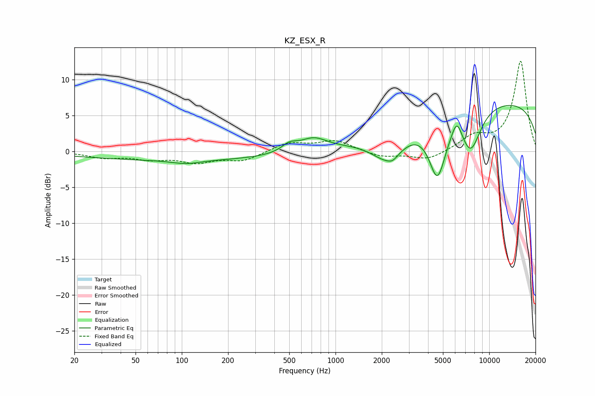

# KZ_ESX_R
See [usage instructions](https://github.com/jaakkopasanen/AutoEq#usage) for more options and info.

### Parametric EQs
Apply preamp of -6.5 dB when using parametric equalizer.

|   # | Type    |   Fc (Hz) |    Q |   Gain (dB) |
|-----|---------|-----------|------|-------------|
|   1 | Peaking |       102 | 0.18 |        -1.2 |
|   2 | Peaking |       107 | 1.5  |        -0.5 |
|   3 | Peaking |       501 | 2.81 |         1   |
|   4 | Peaking |       718 | 1.58 |         1.8 |
|   5 | Peaking |      2199 | 1.26 |        -4.1 |
|   6 | Peaking |      2352 | 4.65 |        -0.5 |
|   7 | Peaking |      4604 | 2.47 |        -8.1 |
|   8 | Peaking |      6156 | 4.22 |         2.5 |
|   9 | Peaking |      7571 | 1.99 |        -5.9 |
|  10 | Peaking |     10000 | 0.18 |         7.2 |

### Fixed Band EQs
When using fixed band (also called graphic) equalizer, apply preamp of **-12.6 dB** (if available) and set gains manually with these parameters.

|   # | Type    |   Fc (Hz) |    Q |   Gain (dB) |
|-----|---------|-----------|------|-------------|
|   1 | Peaking |        31 | 1.41 |        -0.8 |
|   2 | Peaking |        62 | 1.41 |        -0.9 |
|   3 | Peaking |       125 | 1.41 |        -1.4 |
|   4 | Peaking |       250 | 1.41 |        -1.2 |
|   5 | Peaking |       500 | 1.41 |         1.2 |
|   6 | Peaking |      1000 | 1.41 |         1.5 |
|   7 | Peaking |      2000 | 1.41 |        -0.8 |
|   8 | Peaking |      4000 | 1.41 |        -1.2 |
|   9 | Peaking |      8000 | 1.41 |         1.9 |
|  10 | Peaking |     16000 | 1.41 |        12.5 |

### Graphs

