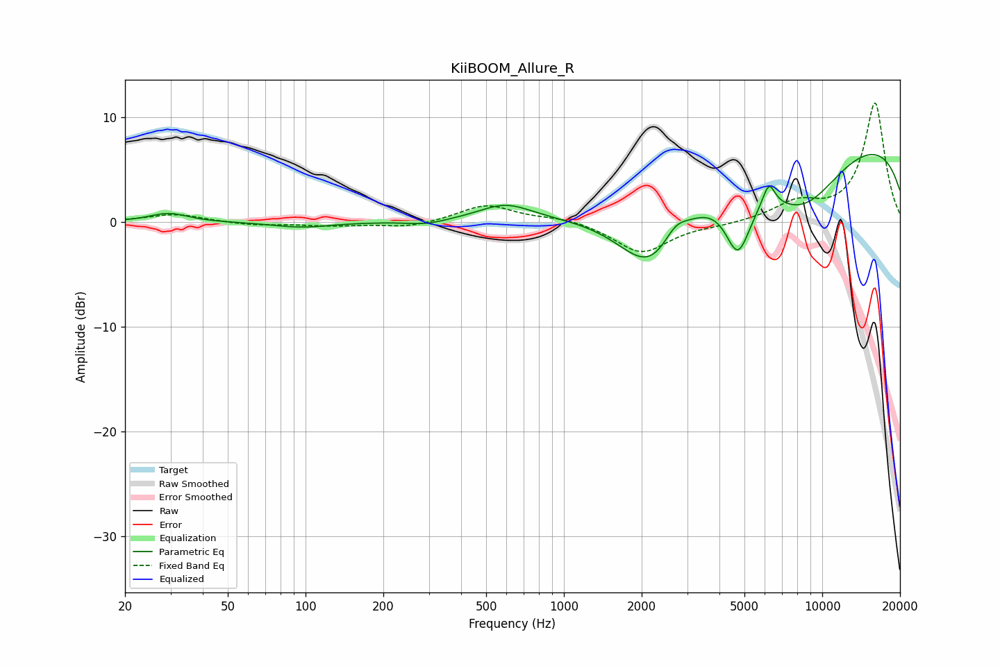

# KiiBOOM_Allure_R
See [usage instructions](https://github.com/jaakkopasanen/AutoEq#usage) for more options and info.

### Parametric EQs
Apply preamp of -6.6 dB when using parametric equalizer.

|   # | Type    |   Fc (Hz) |    Q |   Gain (dB) |
|-----|---------|-----------|------|-------------|
|   1 | Peaking |        29 | 1.93 |         0.9 |
|   2 | Peaking |        96 | 1.28 |        -0.5 |
|   3 | Peaking |       293 | 1.97 |        -0.4 |
|   4 | Peaking |       593 | 1.37 |         1.6 |
|   5 | Peaking |      2181 | 1.03 |        -7.5 |
|   6 | Peaking |      2699 | 3.07 |         1.5 |
|   7 | Peaking |      4718 | 2.77 |        -5.9 |
|   8 | Peaking |      6217 | 5.72 |         2.2 |
|   9 | Peaking |      8367 | 0.77 |        -6.4 |
|  10 | Peaking |     10000 | 0.18 |         8.9 |

### Fixed Band EQs
When using fixed band (also called graphic) equalizer, apply preamp of **-11.5 dB** (if available) and set gains manually with these parameters.

|   # | Type    |   Fc (Hz) |    Q |   Gain (dB) |
|-----|---------|-----------|------|-------------|
|   1 | Peaking |        31 | 1.41 |         0.8 |
|   2 | Peaking |        62 | 1.41 |        -0.3 |
|   3 | Peaking |       125 | 1.41 |        -0.3 |
|   4 | Peaking |       250 | 1.41 |        -0.5 |
|   5 | Peaking |       500 | 1.41 |         1.7 |
|   6 | Peaking |      1000 | 1.41 |         0.4 |
|   7 | Peaking |      2000 | 1.41 |        -3   |
|   8 | Peaking |      4000 | 1.41 |        -0.2 |
|   9 | Peaking |      8000 | 1.41 |         1.7 |
|  10 | Peaking |     16000 | 1.41 |        11.4 |

### Graphs

