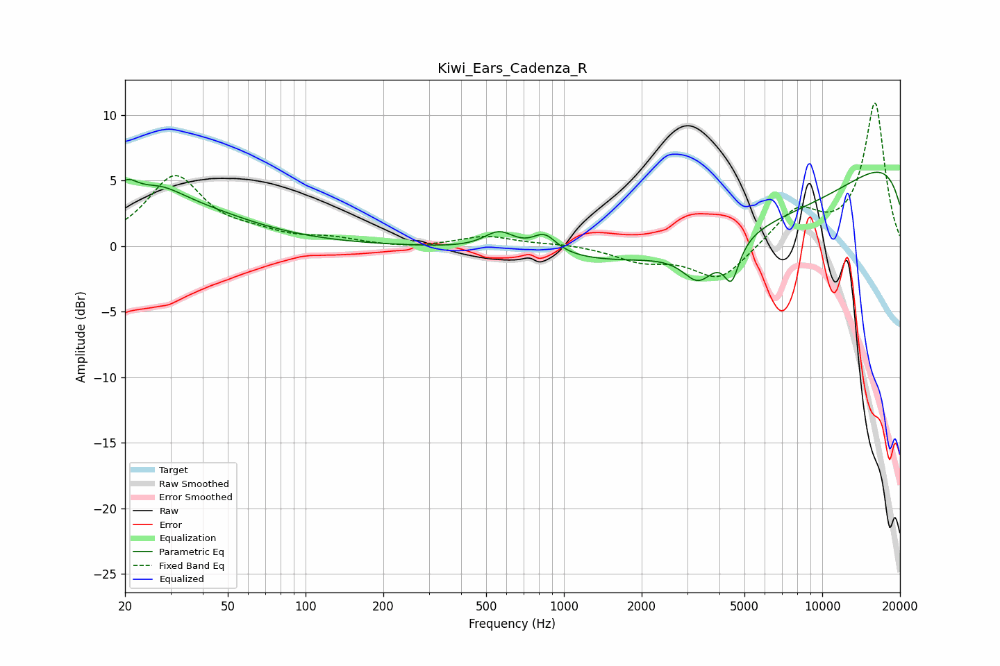

# Kiwi_Ears_Cadenza_R
See [usage instructions](https://github.com/jaakkopasanen/AutoEq#usage) for more options and info.

### Parametric EQs
Apply preamp of -5.7 dB when using parametric equalizer.

|   # | Type    |   Fc (Hz) |    Q |   Gain (dB) |
|-----|---------|-----------|------|-------------|
|   1 | Peaking |        20 | 2.92 |         2.2 |
|   2 | Peaking |        27 | 1.55 |         1.5 |
|   3 | Peaking |        33 | 0.56 |         2.7 |
|   4 | Peaking |       562 | 2.38 |         1.4 |
|   5 | Peaking |       842 | 3.02 |         1.4 |
|   6 | Peaking |      3326 | 2.26 |        -2.6 |
|   7 | Peaking |      4427 | 4.87 |         2   |
|   8 | Peaking |      4444 | 4.69 |        -4.9 |
|   9 | Peaking |      5382 | 0.24 |        -7.5 |
|  10 | Peaking |     10000 | 0.18 |        10.2 |

### Fixed Band EQs
When using fixed band (also called graphic) equalizer, apply preamp of **-11.0 dB** (if available) and set gains manually with these parameters.

|   # | Type    |   Fc (Hz) |    Q |   Gain (dB) |
|-----|---------|-----------|------|-------------|
|   1 | Peaking |        31 | 1.41 |         5.2 |
|   2 | Peaking |        62 | 1.41 |         0.7 |
|   3 | Peaking |       125 | 1.41 |         0.5 |
|   4 | Peaking |       250 | 1.41 |        -0.2 |
|   5 | Peaking |       500 | 1.41 |         0.8 |
|   6 | Peaking |      1000 | 1.41 |         0.2 |
|   7 | Peaking |      2000 | 1.41 |        -1   |
|   8 | Peaking |      4000 | 1.41 |        -2.6 |
|   9 | Peaking |      8000 | 1.41 |         2.7 |
|  10 | Peaking |     16000 | 1.41 |        10.9 |

### Graphs

