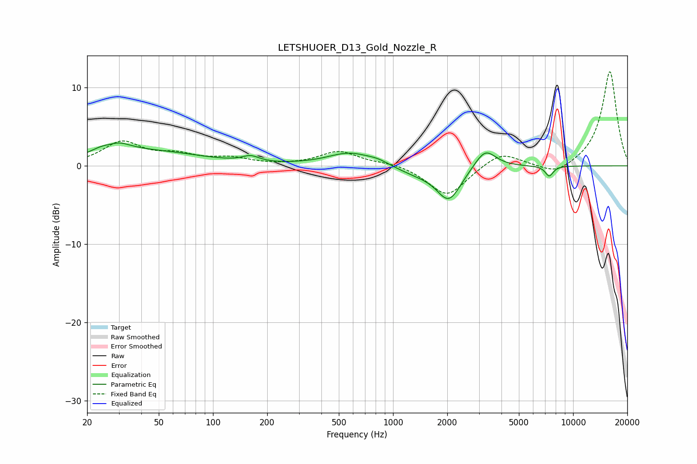

# LETSHUOER_D13_Gold_Nozzle_R
See [usage instructions](https://github.com/jaakkopasanen/AutoEq#usage) for more options and info.

### Parametric EQs
Apply preamp of -3.0 dB when using parametric equalizer.

|   # | Type    |   Fc (Hz) |    Q |   Gain (dB) |
|-----|---------|-----------|------|-------------|
|   1 | Peaking |        27 | 2.78 |        -1.1 |
|   2 | Peaking |        27 | 1.75 |         2.8 |
|   3 | Peaking |        49 | 0.54 |         1.6 |
|   4 | Peaking |       162 | 3.08 |         0.7 |
|   5 | Peaking |       574 | 1.16 |         1.7 |
|   6 | Peaking |       824 | 2.38 |         0.5 |
|   7 | Peaking |      1356 | 1.18 |        -0.9 |
|   8 | Peaking |      2044 | 2.09 |        -4.2 |
|   9 | Peaking |      3249 | 2.39 |         2.5 |
|  10 | Peaking |      7370 | 6    |        -1.3 |

### Fixed Band EQs
When using fixed band (also called graphic) equalizer, apply preamp of **-12.1 dB** (if available) and set gains manually with these parameters.

|   # | Type    |   Fc (Hz) |    Q |   Gain (dB) |
|-----|---------|-----------|------|-------------|
|   1 | Peaking |        31 | 1.41 |         2.9 |
|   2 | Peaking |        62 | 1.41 |         1.2 |
|   3 | Peaking |       125 | 1.41 |         0.9 |
|   4 | Peaking |       250 | 1.41 |        -0   |
|   5 | Peaking |       500 | 1.41 |         1.8 |
|   6 | Peaking |      1000 | 1.41 |         0.4 |
|   7 | Peaking |      2000 | 1.41 |        -4   |
|   8 | Peaking |      4000 | 1.41 |         1.9 |
|   9 | Peaking |      8000 | 1.41 |        -1.3 |
|  10 | Peaking |     16000 | 1.41 |        12.2 |

### Graphs

