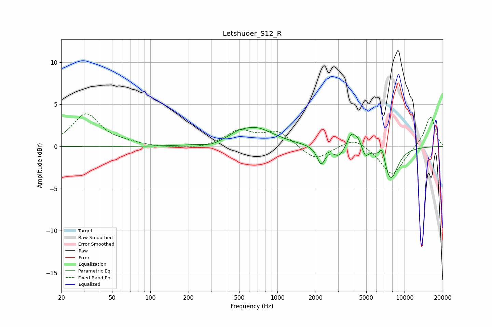

# Letshuoer_S12_R
See [usage instructions](https://github.com/jaakkopasanen/AutoEq#usage) for more options and info.

### Parametric EQs
Apply preamp of -2.4 dB when using parametric equalizer.

|   # | Type    |   Fc (Hz) |    Q |   Gain (dB) |
|-----|---------|-----------|------|-------------|
|   1 | Peaking |       302 | 2.31 |        -0.3 |
|   2 | Peaking |       480 | 2.93 |         0.3 |
|   3 | Peaking |       656 | 0.93 |         2.2 |
|   4 | Peaking |      2207 | 4.48 |        -2.1 |
|   5 | Peaking |      3048 | 3.63 |        -1.2 |
|   6 | Peaking |      3841 | 4.27 |         1.8 |
|   7 | Peaking |      4316 | 6    |         0.8 |
|   8 | Peaking |      4928 | 6    |        -1   |
|   9 | Peaking |      6678 | 6    |         1.8 |
|  10 | Peaking |      7753 | 2.31 |        -4   |

### Fixed Band EQs
When using fixed band (also called graphic) equalizer, apply preamp of **-4.0 dB** (if available) and set gains manually with these parameters.

|   # | Type    |   Fc (Hz) |    Q |   Gain (dB) |
|-----|---------|-----------|------|-------------|
|   1 | Peaking |        31 | 1.41 |         3.8 |
|   2 | Peaking |        62 | 1.41 |         0.3 |
|   3 | Peaking |       125 | 1.41 |        -0.2 |
|   4 | Peaking |       250 | 1.41 |        -0.3 |
|   5 | Peaking |       500 | 1.41 |         1.8 |
|   6 | Peaking |      1000 | 1.41 |         1.7 |
|   7 | Peaking |      2000 | 1.41 |        -1.7 |
|   8 | Peaking |      4000 | 1.41 |         1.2 |
|   9 | Peaking |      8000 | 1.41 |        -3.5 |
|  10 | Peaking |     16000 | 1.41 |         3.6 |

### Graphs

