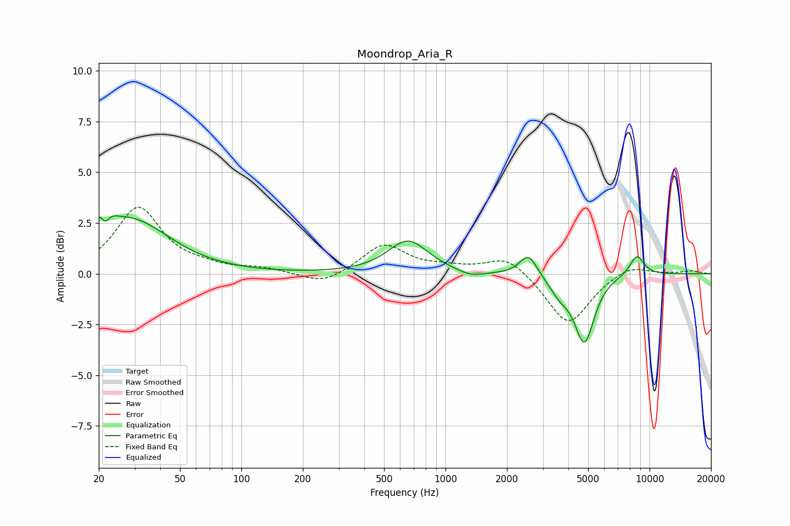

# Moondrop_Aria_R
See [usage instructions](https://github.com/jaakkopasanen/AutoEq#usage) for more options and info.

### Parametric EQs
Apply preamp of -3.0 dB when using parametric equalizer.

|   # | Type    |   Fc (Hz) |    Q |   Gain (dB) |
|-----|---------|-----------|------|-------------|
|   1 | Peaking |        21 | 3.97 |         2.3 |
|   2 | Peaking |        21 | 5.97 |        -1.7 |
|   3 | Peaking |        26 | 1.26 |         0.5 |
|   4 | Peaking |        31 | 0.77 |         2.1 |
|   5 | Peaking |       655 | 1.45 |         1.6 |
|   6 | Peaking |      1329 | 2.19 |        -0.3 |
|   7 | Peaking |      2550 | 3.31 |         1.1 |
|   8 | Peaking |      3637 | 2.76 |        -0.7 |
|   9 | Peaking |      4796 | 2.9  |        -3.3 |
|  10 | Peaking |      8667 | 3.62 |         1   |

### Fixed Band EQs
When using fixed band (also called graphic) equalizer, apply preamp of **-3.4 dB** (if available) and set gains manually with these parameters.

|   # | Type    |   Fc (Hz) |    Q |   Gain (dB) |
|-----|---------|-----------|------|-------------|
|   1 | Peaking |        31 | 1.41 |         3.2 |
|   2 | Peaking |        62 | 1.41 |         0.2 |
|   3 | Peaking |       125 | 1.41 |         0.2 |
|   4 | Peaking |       250 | 1.41 |        -0.6 |
|   5 | Peaking |       500 | 1.41 |         1.4 |
|   6 | Peaking |      1000 | 1.41 |         0.2 |
|   7 | Peaking |      2000 | 1.41 |         0.9 |
|   8 | Peaking |      4000 | 1.41 |        -2.6 |
|   9 | Peaking |      8000 | 1.41 |         0.5 |
|  10 | Peaking |     16000 | 1.41 |         0.1 |

### Graphs

