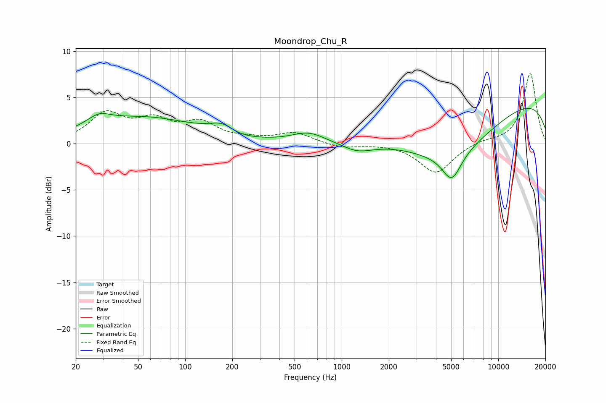

# Moondrop_Chu_R
See [usage instructions](https://github.com/jaakkopasanen/AutoEq#usage) for more options and info.

### Parametric EQs
Apply preamp of -3.9 dB when using parametric equalizer.

|   # | Type    |   Fc (Hz) |    Q |   Gain (dB) |
|-----|---------|-----------|------|-------------|
|   1 | Peaking |        28 | 1.88 |         1.1 |
|   2 | Peaking |        53 | 0.4  |         2.8 |
|   3 | Peaking |       178 | 1.63 |         1.7 |
|   4 | Peaking |       199 | 1.49 |        -0.9 |
|   5 | Peaking |       615 | 1.33 |         1.1 |
|   6 | Peaking |      1264 | 1.4  |        -1   |
|   7 | Peaking |      4888 | 0.45 |        -5.5 |
|   8 | Peaking |      5047 | 2.34 |        -3   |
|   9 | Peaking |      9089 | 0.18 |         1.9 |
|  10 | Peaking |     10000 | 0.18 |         3.4 |

### Fixed Band EQs
When using fixed band (also called graphic) equalizer, apply preamp of **-7.7 dB** (if available) and set gains manually with these parameters.

|   # | Type    |   Fc (Hz) |    Q |   Gain (dB) |
|-----|---------|-----------|------|-------------|
|   1 | Peaking |        31 | 1.41 |         3.1 |
|   2 | Peaking |        62 | 1.41 |         2.2 |
|   3 | Peaking |       125 | 1.41 |         2   |
|   4 | Peaking |       250 | 1.41 |         0.4 |
|   5 | Peaking |       500 | 1.41 |         1.1 |
|   6 | Peaking |      1000 | 1.41 |        -0.5 |
|   7 | Peaking |      2000 | 1.41 |         0   |
|   8 | Peaking |      4000 | 1.41 |        -3.2 |
|   9 | Peaking |      8000 | 1.41 |         0.4 |
|  10 | Peaking |     16000 | 1.41 |         7.6 |

### Graphs

