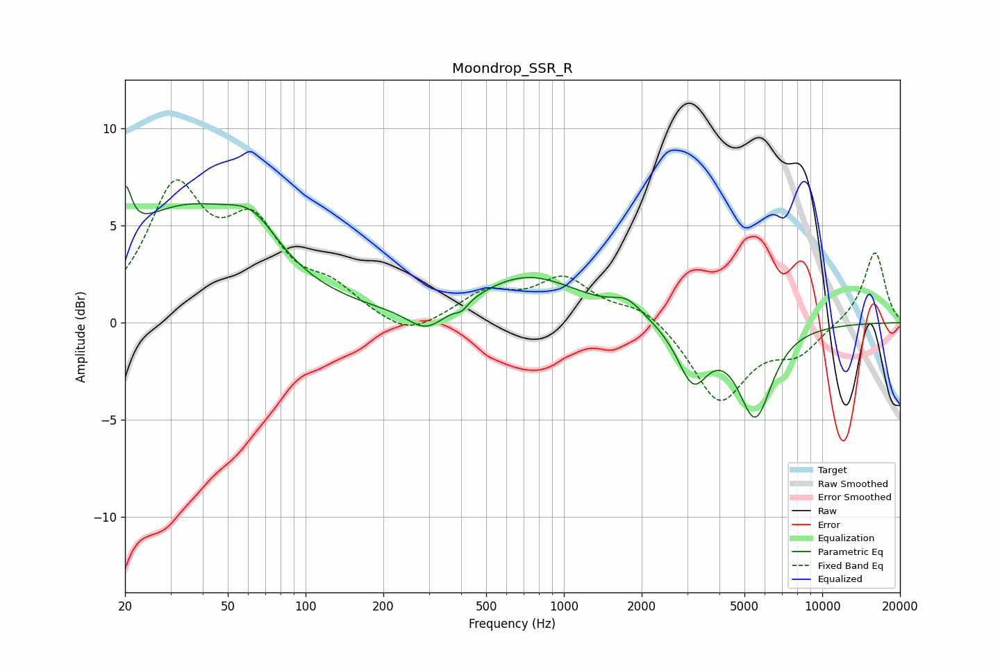

# Moondrop_SSR_R
See [usage instructions](https://github.com/jaakkopasanen/AutoEq#usage) for more options and info.

### Parametric EQs
Apply preamp of -7.1 dB when using parametric equalizer.

|   # | Type    |   Fc (Hz) |    Q |   Gain (dB) |
|-----|---------|-----------|------|-------------|
|   1 | Peaking |        20 | 5.98 |         2.6 |
|   2 | Peaking |        34 | 0.49 |         5.6 |
|   3 | Peaking |        63 | 1.47 |         1.8 |
|   4 | Peaking |       292 | 1.95 |        -1.1 |
|   5 | Peaking |       344 | 1.37 |        -0.2 |
|   6 | Peaking |       402 | 5.96 |        -0.4 |
|   7 | Peaking |       722 | 0.68 |         2.4 |
|   8 | Peaking |      1757 | 2.42 |         0.8 |
|   9 | Peaking |      3157 | 2.38 |        -2.9 |
|  10 | Peaking |      5503 | 2.13 |        -4.7 |

### Fixed Band EQs
When using fixed band (also called graphic) equalizer, apply preamp of **-7.4 dB** (if available) and set gains manually with these parameters.

|   # | Type    |   Fc (Hz) |    Q |   Gain (dB) |
|-----|---------|-----------|------|-------------|
|   1 | Peaking |        31 | 1.41 |         6.5 |
|   2 | Peaking |        62 | 1.41 |         4.3 |
|   3 | Peaking |       125 | 1.41 |         1.4 |
|   4 | Peaking |       250 | 1.41 |        -0.9 |
|   5 | Peaking |       500 | 1.41 |         1.4 |
|   6 | Peaking |      1000 | 1.41 |         2.1 |
|   7 | Peaking |      2000 | 1.41 |         0.9 |
|   8 | Peaking |      4000 | 1.41 |        -4.1 |
|   9 | Peaking |      8000 | 1.41 |        -1.4 |
|  10 | Peaking |     16000 | 1.41 |         3.7 |

### Graphs

