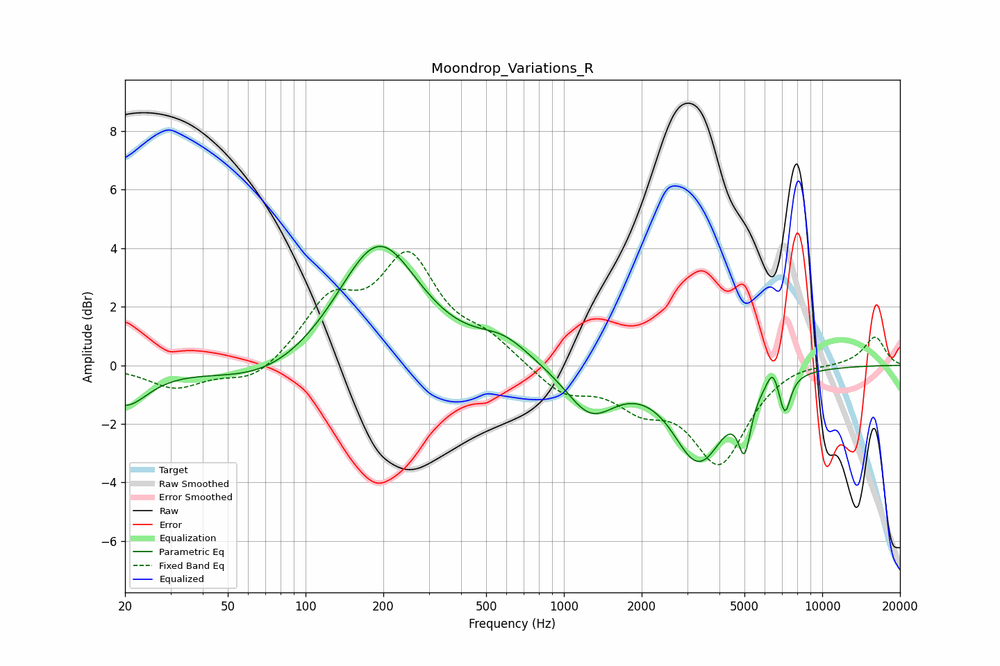

# Moondrop_Variations_R
See [usage instructions](https://github.com/jaakkopasanen/AutoEq#usage) for more options and info.

### Parametric EQs
Apply preamp of -4.2 dB when using parametric equalizer.

|   # | Type    |   Fc (Hz) |    Q |   Gain (dB) |
|-----|---------|-----------|------|-------------|
|   1 | Peaking |        20 | 1.62 |        -1.3 |
|   2 | Peaking |        71 | 0.7  |        -0.7 |
|   3 | Peaking |       191 | 0.92 |         4.2 |
|   4 | Peaking |       582 | 1.37 |         0.7 |
|   5 | Peaking |      1268 | 1.47 |        -1.6 |
|   6 | Peaking |      3315 | 2.94 |         0.2 |
|   7 | Peaking |      3326 | 1.49 |        -3.3 |
|   8 | Peaking |      5004 | 5.76 |        -1.8 |
|   9 | Peaking |      6428 | 6    |         0.7 |
|  10 | Peaking |      7169 | 6    |        -1.3 |

### Fixed Band EQs
When using fixed band (also called graphic) equalizer, apply preamp of **-4.0 dB** (if available) and set gains manually with these parameters.

|   # | Type    |   Fc (Hz) |    Q |   Gain (dB) |
|-----|---------|-----------|------|-------------|
|   1 | Peaking |        31 | 1.41 |        -0.8 |
|   2 | Peaking |        62 | 1.41 |        -0.6 |
|   3 | Peaking |       125 | 1.41 |         2   |
|   4 | Peaking |       250 | 1.41 |         3.4 |
|   5 | Peaking |       500 | 1.41 |         0.8 |
|   6 | Peaking |      1000 | 1.41 |        -0.9 |
|   7 | Peaking |      2000 | 1.41 |        -1.1 |
|   8 | Peaking |      4000 | 1.41 |        -3.2 |
|   9 | Peaking |      8000 | 1.41 |         0.2 |
|  10 | Peaking |     16000 | 1.41 |         1   |

### Graphs

