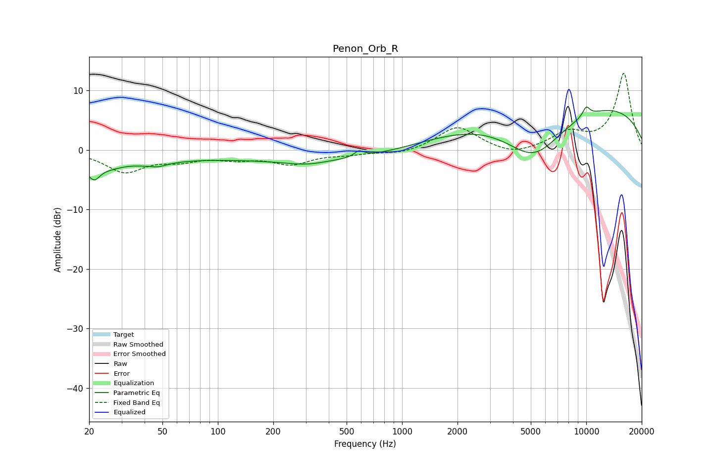

# Penon_Orb_R
See [usage instructions](https://github.com/jaakkopasanen/AutoEq#usage) for more options and info.

### Parametric EQs
Apply preamp of -7.3 dB when using parametric equalizer.

|   # | Type    |   Fc (Hz) |    Q |   Gain (dB) |
|-----|---------|-----------|------|-------------|
|   1 | Peaking |        21 | 0.44 |        -3.2 |
|   2 | Peaking |        21 | 5.11 |        -1.8 |
|   3 | Peaking |        33 | 2.39 |         0.4 |
|   4 | Peaking |        47 | 3.24 |        -0.5 |
|   5 | Peaking |       301 | 1.43 |        -0.6 |
|   6 | Peaking |       401 | 0.25 |        -2   |
|   7 | Peaking |       584 | 5.7  |         1   |
|   8 | Peaking |      5184 | 0.82 |        -8.5 |
|   9 | Peaking |      7957 | 0.18 |         8.6 |
|  10 | Peaking |     10000 | 6    |         1.6 |

### Fixed Band EQs
When using fixed band (also called graphic) equalizer, apply preamp of **-13.0 dB** (if available) and set gains manually with these parameters.

|   # | Type    |   Fc (Hz) |    Q |   Gain (dB) |
|-----|---------|-----------|------|-------------|
|   1 | Peaking |        31 | 1.41 |        -3.5 |
|   2 | Peaking |        62 | 1.41 |        -1.4 |
|   3 | Peaking |       125 | 1.41 |        -1.2 |
|   4 | Peaking |       250 | 1.41 |        -2.2 |
|   5 | Peaking |       500 | 1.41 |        -0.6 |
|   6 | Peaking |      1000 | 1.41 |        -0.7 |
|   7 | Peaking |      2000 | 1.41 |         4   |
|   8 | Peaking |      4000 | 1.41 |        -1.1 |
|   9 | Peaking |      8000 | 1.41 |         2.7 |
|  10 | Peaking |     16000 | 1.41 |        12.9 |

### Graphs

