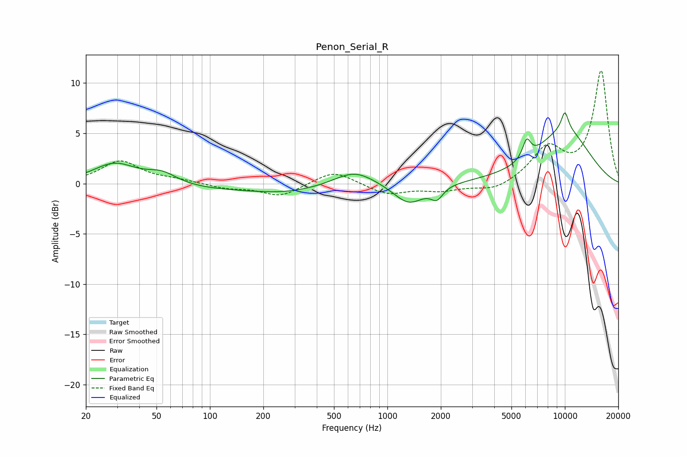

# Penon_Serial_R
See [usage instructions](https://github.com/jaakkopasanen/AutoEq#usage) for more options and info.

### Parametric EQs
Apply preamp of -7.1 dB when using parametric equalizer.

|   # | Type    |   Fc (Hz) |    Q |   Gain (dB) |
|-----|---------|-----------|------|-------------|
|   1 | Peaking |        29 | 1.14 |         2.2 |
|   2 | Peaking |        54 | 1.61 |         1.2 |
|   3 | Peaking |       158 | 0.18 |        -0.7 |
|   4 | Peaking |       259 | 0.88 |        -0.3 |
|   5 | Peaking |       652 | 1.19 |         1.7 |
|   6 | Peaking |      1320 | 1.68 |        -2   |
|   7 | Peaking |      1900 | 4.26 |        -1.2 |
|   8 | Peaking |      6090 | 6    |         1.8 |
|   9 | Peaking |     10000 | 6    |         1.8 |
|  10 | Peaking |     10000 | 0.75 |         5.2 |

### Fixed Band EQs
When using fixed band (also called graphic) equalizer, apply preamp of **-11.3 dB** (if available) and set gains manually with these parameters.

|   # | Type    |   Fc (Hz) |    Q |   Gain (dB) |
|-----|---------|-----------|------|-------------|
|   1 | Peaking |        31 | 1.41 |         2.2 |
|   2 | Peaking |        62 | 1.41 |         0.3 |
|   3 | Peaking |       125 | 1.41 |        -0.4 |
|   4 | Peaking |       250 | 1.41 |        -1.3 |
|   5 | Peaking |       500 | 1.41 |         1.4 |
|   6 | Peaking |      1000 | 1.41 |        -1.1 |
|   7 | Peaking |      2000 | 1.41 |        -0.6 |
|   8 | Peaking |      4000 | 1.41 |        -0.8 |
|   9 | Peaking |      8000 | 1.41 |         3.4 |
|  10 | Peaking |     16000 | 1.41 |        11.1 |

### Graphs

