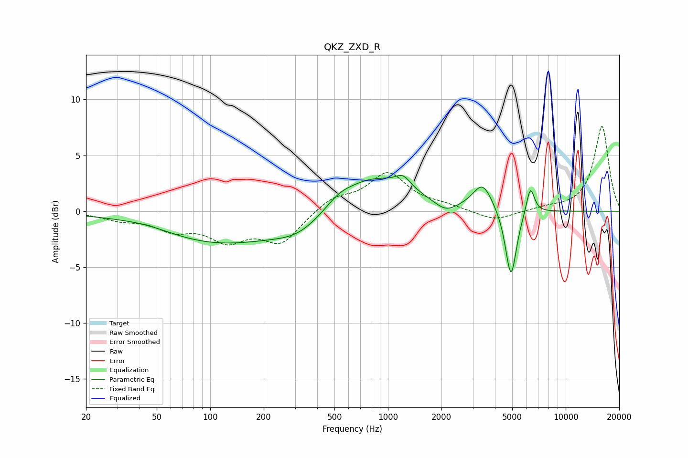

# QKZ_ZXD_R
See [usage instructions](https://github.com/jaakkopasanen/AutoEq#usage) for more options and info.

### Parametric EQs
Apply preamp of -3.3 dB when using parametric equalizer.

|   # | Type    |   Fc (Hz) |    Q |   Gain (dB) |
|-----|---------|-----------|------|-------------|
|   1 | Peaking |        45 | 0.87 |         0.5 |
|   2 | Peaking |       112 | 0.37 |        -2.9 |
|   3 | Peaking |       320 | 0.99 |        -1.5 |
|   4 | Peaking |       528 | 2.24 |         0.5 |
|   5 | Peaking |       800 | 0.65 |         3.3 |
|   6 | Peaking |      1217 | 3.34 |         1   |
|   7 | Peaking |      2111 | 2.2  |        -1   |
|   8 | Peaking |      3410 | 2.59 |         2.4 |
|   9 | Peaking |      4922 | 4.47 |        -6.2 |
|  10 | Peaking |      6326 | 5.99 |         2.5 |

### Fixed Band EQs
When using fixed band (also called graphic) equalizer, apply preamp of **-7.7 dB** (if available) and set gains manually with these parameters.

|   # | Type    |   Fc (Hz) |    Q |   Gain (dB) |
|-----|---------|-----------|------|-------------|
|   1 | Peaking |        31 | 1.41 |        -0.6 |
|   2 | Peaking |        62 | 1.41 |        -1.4 |
|   3 | Peaking |       125 | 1.41 |        -2.3 |
|   4 | Peaking |       250 | 1.41 |        -2.7 |
|   5 | Peaking |       500 | 1.41 |         1.2 |
|   6 | Peaking |      1000 | 1.41 |         3.3 |
|   7 | Peaking |      2000 | 1.41 |         0.4 |
|   8 | Peaking |      4000 | 1.41 |        -0.9 |
|   9 | Peaking |      8000 | 1.41 |         0.3 |
|  10 | Peaking |     16000 | 1.41 |         7.6 |

### Graphs

