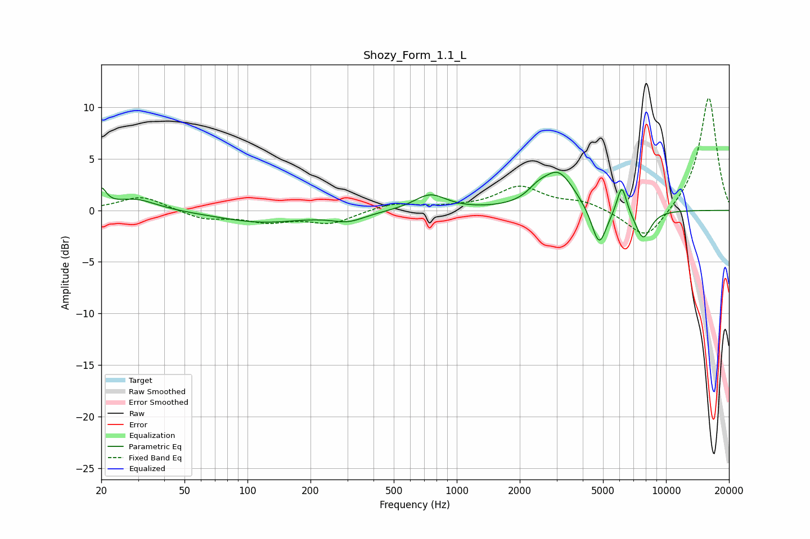

# Shozy_Form_1.1_L
See [usage instructions](https://github.com/jaakkopasanen/AutoEq#usage) for more options and info.

### Parametric EQs
Apply preamp of -3.8 dB when using parametric equalizer.

|   # | Type    |   Fc (Hz) |    Q |   Gain (dB) |
|-----|---------|-----------|------|-------------|
|   1 | Peaking |        20 | 5.99 |         1.7 |
|   2 | Peaking |        29 | 1.38 |         1.1 |
|   3 | Peaking |       117 | 0.67 |        -1.1 |
|   4 | Peaking |       303 | 1.74 |        -0.8 |
|   5 | Peaking |       745 | 1.86 |         1.5 |
|   6 | Peaking |      2428 | 2.94 |         0.8 |
|   7 | Peaking |      3059 | 1.82 |         3.6 |
|   8 | Peaking |      4790 | 3.83 |        -3.9 |
|   9 | Peaking |      6149 | 5.94 |         2.9 |
|  10 | Peaking |      7772 | 3.5  |        -2.8 |

### Fixed Band EQs
When using fixed band (also called graphic) equalizer, apply preamp of **-11.0 dB** (if available) and set gains manually with these parameters.

|   # | Type    |   Fc (Hz) |    Q |   Gain (dB) |
|-----|---------|-----------|------|-------------|
|   1 | Peaking |        31 | 1.41 |         1.4 |
|   2 | Peaking |        62 | 1.41 |        -0.8 |
|   3 | Peaking |       125 | 1.41 |        -1   |
|   4 | Peaking |       250 | 1.41 |        -1.2 |
|   5 | Peaking |       500 | 1.41 |         0.7 |
|   6 | Peaking |      1000 | 1.41 |         0.2 |
|   7 | Peaking |      2000 | 1.41 |         2.2 |
|   8 | Peaking |      4000 | 1.41 |         0.8 |
|   9 | Peaking |      8000 | 1.41 |        -3   |
|  10 | Peaking |     16000 | 1.41 |        11.1 |

### Graphs

