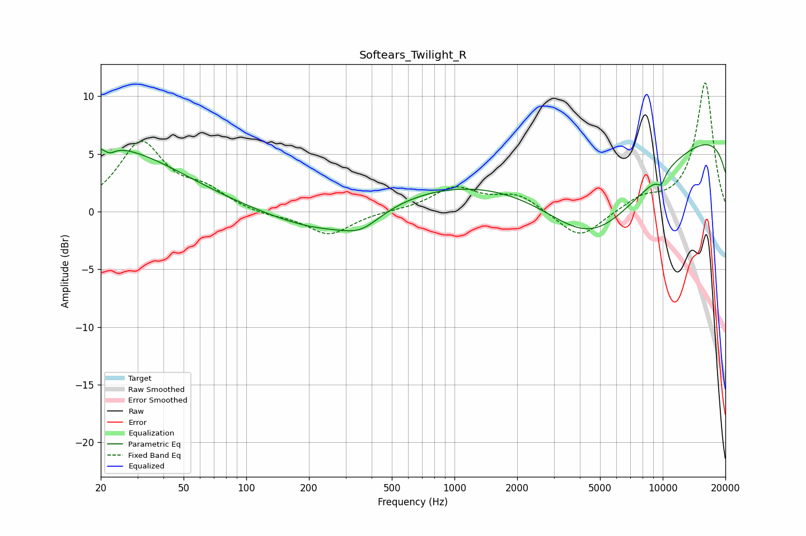

# Softears_Twilight_R
See [usage instructions](https://github.com/jaakkopasanen/AutoEq#usage) for more options and info.

### Parametric EQs
Apply preamp of -5.9 dB when using parametric equalizer.

|   # | Type    |   Fc (Hz) |    Q |   Gain (dB) |
|-----|---------|-----------|------|-------------|
|   1 | Peaking |        20 | 0.38 |         5.8 |
|   2 | Peaking |        22 | 5.78 |         0.3 |
|   3 | Peaking |        22 | 5.36 |        -0.8 |
|   4 | Peaking |        57 | 0.26 |        -0.1 |
|   5 | Peaking |       242 | 0.59 |        -2.1 |
|   6 | Peaking |       356 | 1.54 |        -1.3 |
|   7 | Peaking |      1595 | 0.27 |         6.9 |
|   8 | Peaking |      4526 | 0.27 |       -19.7 |
|   9 | Peaking |      8559 | 0.18 |        15.5 |
|  10 | Peaking |      9836 | 6    |        -0.9 |

### Fixed Band EQs
When using fixed band (also called graphic) equalizer, apply preamp of **-11.2 dB** (if available) and set gains manually with these parameters.

|   # | Type    |   Fc (Hz) |    Q |   Gain (dB) |
|-----|---------|-----------|------|-------------|
|   1 | Peaking |        31 | 1.41 |         5.8 |
|   2 | Peaking |        62 | 1.41 |         1.6 |
|   3 | Peaking |       125 | 1.41 |        -0.4 |
|   4 | Peaking |       250 | 1.41 |        -2   |
|   5 | Peaking |       500 | 1.41 |         0   |
|   6 | Peaking |      1000 | 1.41 |         2   |
|   7 | Peaking |      2000 | 1.41 |         1.4 |
|   8 | Peaking |      4000 | 1.41 |        -2.5 |
|   9 | Peaking |      8000 | 1.41 |         1.1 |
|  10 | Peaking |     16000 | 1.41 |        11.2 |

### Graphs

