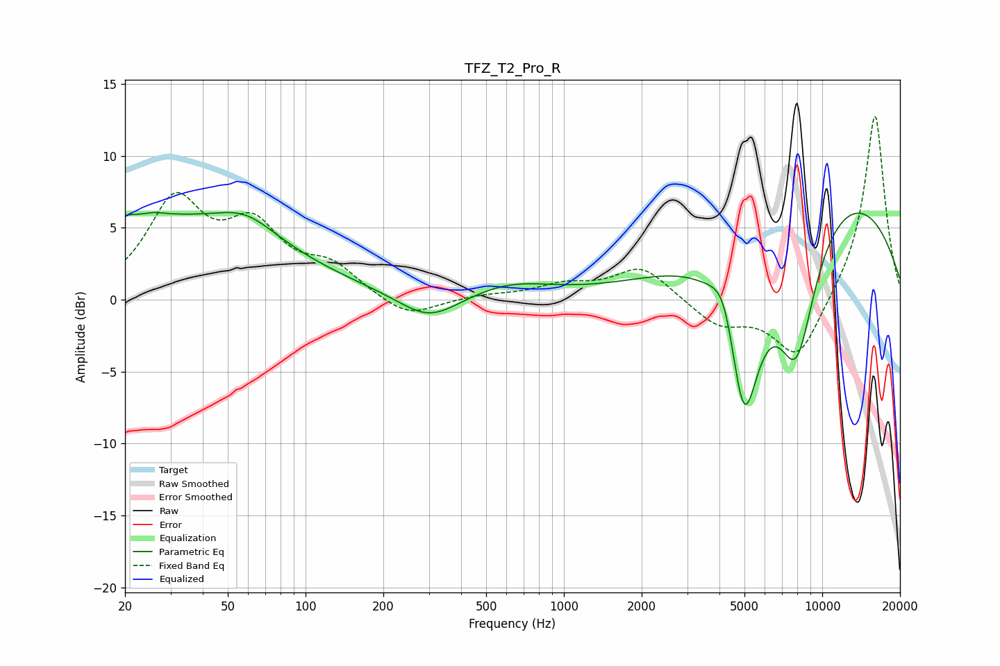

# TFZ_T2_Pro_R
See [usage instructions](https://github.com/jaakkopasanen/AutoEq#usage) for more options and info.

### Parametric EQs
Apply preamp of -6.2 dB when using parametric equalizer.

|   # | Type    |   Fc (Hz) |    Q |   Gain (dB) |
|-----|---------|-----------|------|-------------|
|   1 | Peaking |        21 | 0.22 |         5.7 |
|   2 | Peaking |        27 | 5.62 |         1.3 |
|   3 | Peaking |        27 | 5.82 |        -1.1 |
|   4 | Peaking |        59 | 1.21 |         1.6 |
|   5 | Peaking |       301 | 1.21 |        -1.9 |
|   6 | Peaking |       618 | 0.86 |         1.1 |
|   7 | Peaking |      4194 | 2.79 |         3   |
|   8 | Peaking |      4967 | 2.05 |       -12.5 |
|   9 | Peaking |      7942 | 1.63 |        -9.8 |
|  10 | Peaking |     10000 | 0.29 |         8.2 |

### Fixed Band EQs
When using fixed band (also called graphic) equalizer, apply preamp of **-12.9 dB** (if available) and set gains manually with these parameters.

|   # | Type    |   Fc (Hz) |    Q |   Gain (dB) |
|-----|---------|-----------|------|-------------|
|   1 | Peaking |        31 | 1.41 |         6.5 |
|   2 | Peaking |        62 | 1.41 |         4.4 |
|   3 | Peaking |       125 | 1.41 |         2   |
|   4 | Peaking |       250 | 1.41 |        -1.4 |
|   5 | Peaking |       500 | 1.41 |         0.3 |
|   6 | Peaking |      1000 | 1.41 |         0.9 |
|   7 | Peaking |      2000 | 1.41 |         2.3 |
|   8 | Peaking |      4000 | 1.41 |        -1.8 |
|   9 | Peaking |      8000 | 1.41 |        -4.3 |
|  10 | Peaking |     16000 | 1.41 |        13.1 |

### Graphs

