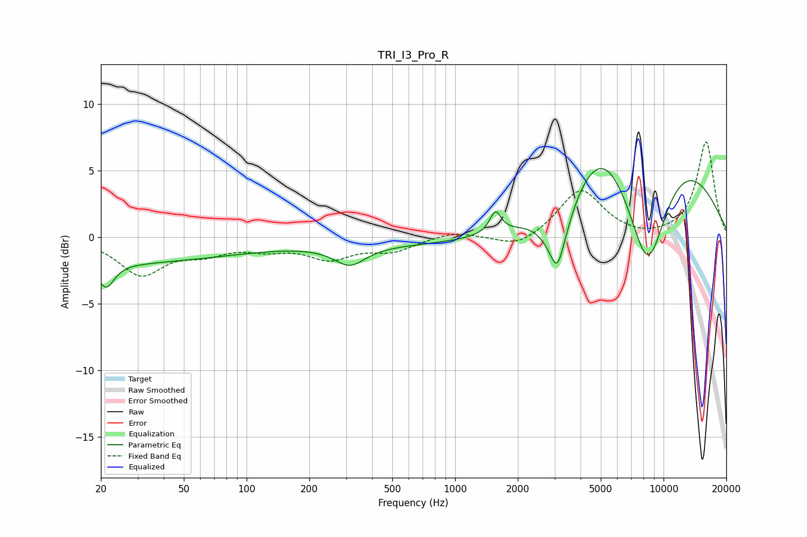

# TRI_I3_Pro_R
See [usage instructions](https://github.com/jaakkopasanen/AutoEq#usage) for more options and info.

### Parametric EQs
Apply preamp of -5.3 dB when using parametric equalizer.

|   # | Type    |   Fc (Hz) |    Q |   Gain (dB) |
|-----|---------|-----------|------|-------------|
|   1 | Peaking |        20 | 0.2  |        -1.9 |
|   2 | Peaking |        21 | 3.77 |        -1.8 |
|   3 | Peaking |       313 | 1.91 |        -1.4 |
|   4 | Peaking |       834 | 0.18 |        -0.6 |
|   5 | Peaking |      1562 | 5.33 |         1.6 |
|   6 | Peaking |      3094 | 5.92 |        -1.1 |
|   7 | Peaking |      3096 | 2.28 |        -4.4 |
|   8 | Peaking |      5021 | 1.03 |         3.7 |
|   9 | Peaking |      8392 | 1.07 |       -12.6 |
|  10 | Peaking |      9105 | 0.42 |        10.3 |

### Fixed Band EQs
When using fixed band (also called graphic) equalizer, apply preamp of **-7.3 dB** (if available) and set gains manually with these parameters.

|   # | Type    |   Fc (Hz) |    Q |   Gain (dB) |
|-----|---------|-----------|------|-------------|
|   1 | Peaking |        31 | 1.41 |        -2.7 |
|   2 | Peaking |        62 | 1.41 |        -1   |
|   3 | Peaking |       125 | 1.41 |        -0.7 |
|   4 | Peaking |       250 | 1.41 |        -1.5 |
|   5 | Peaking |       500 | 1.41 |        -0.9 |
|   6 | Peaking |      1000 | 1.41 |         0.5 |
|   7 | Peaking |      2000 | 1.41 |        -0.9 |
|   8 | Peaking |      4000 | 1.41 |         3.6 |
|   9 | Peaking |      8000 | 1.41 |        -0.2 |
|  10 | Peaking |     16000 | 1.41 |         7.2 |

### Graphs

