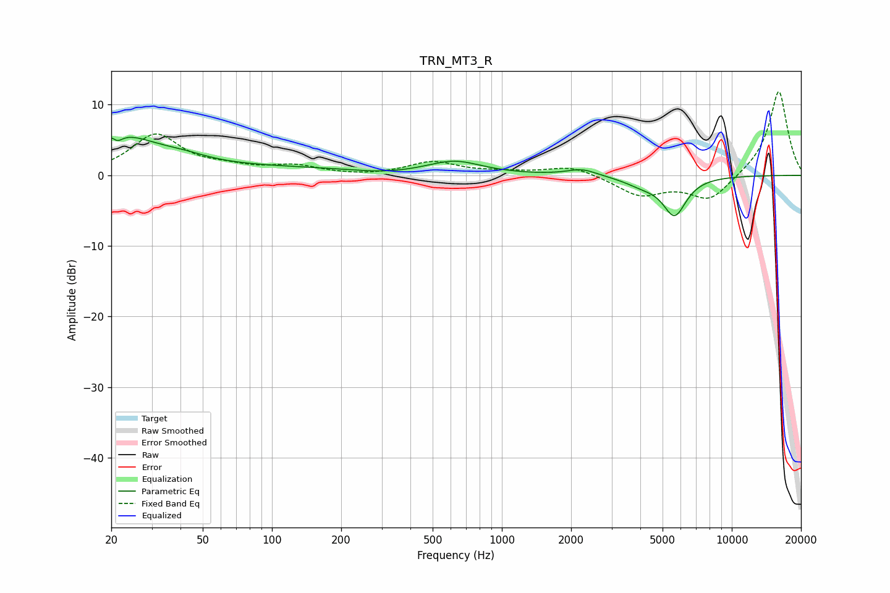

# TRN_MT3_R
See [usage instructions](https://github.com/jaakkopasanen/AutoEq#usage) for more options and info.

### Parametric EQs
Apply preamp of -5.5 dB when using parametric equalizer.

|   # | Type    |   Fc (Hz) |    Q |   Gain (dB) |
|-----|---------|-----------|------|-------------|
|   1 | Peaking |        21 | 5.8  |         3.2 |
|   2 | Peaking |        21 | 5.99 |        -3.5 |
|   3 | Peaking |        22 | 0.96 |         4.8 |
|   4 | Peaking |        41 | 1.25 |         1   |
|   5 | Peaking |       101 | 0.26 |         1.1 |
|   6 | Peaking |       304 | 0.99 |        -0.5 |
|   7 | Peaking |       623 | 1.23 |         1.8 |
|   8 | Peaking |      2232 | 2.21 |         0.9 |
|   9 | Peaking |      4078 | 1.79 |        -1.1 |
|  10 | Peaking |      5639 | 2.72 |        -5.3 |

### Fixed Band EQs
When using fixed band (also called graphic) equalizer, apply preamp of **-11.9 dB** (if available) and set gains manually with these parameters.

|   # | Type    |   Fc (Hz) |    Q |   Gain (dB) |
|-----|---------|-----------|------|-------------|
|   1 | Peaking |        31 | 1.41 |         5.7 |
|   2 | Peaking |        62 | 1.41 |         0.8 |
|   3 | Peaking |       125 | 1.41 |         1.2 |
|   4 | Peaking |       250 | 1.41 |        -0.2 |
|   5 | Peaking |       500 | 1.41 |         1.8 |
|   6 | Peaking |      1000 | 1.41 |         0.3 |
|   7 | Peaking |      2000 | 1.41 |         1.3 |
|   8 | Peaking |      4000 | 1.41 |        -2.8 |
|   9 | Peaking |      8000 | 1.41 |        -3.6 |
|  10 | Peaking |     16000 | 1.41 |        12.1 |

### Graphs

