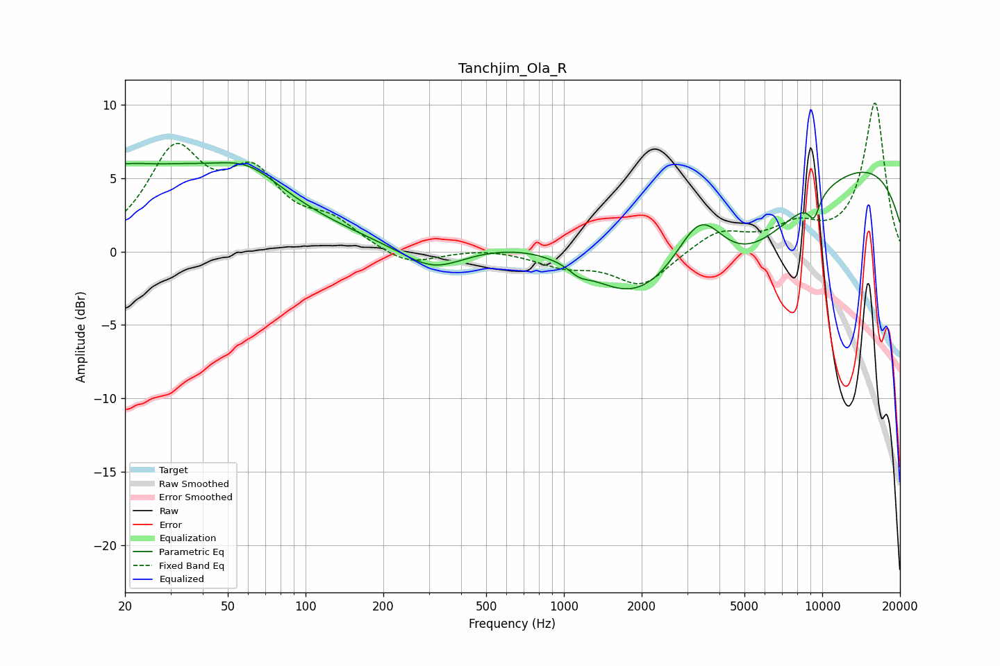

# Tanchjim_Ola_R
See [usage instructions](https://github.com/jaakkopasanen/AutoEq#usage) for more options and info.

### Parametric EQs
Apply preamp of -6.2 dB when using parametric equalizer.

|   # | Type    |   Fc (Hz) |    Q |   Gain (dB) |
|-----|---------|-----------|------|-------------|
|   1 | Peaking |        20 | 0.22 |         5.9 |
|   2 | Peaking |        27 | 3.62 |        -0.1 |
|   3 | Peaking |        60 | 1.17 |         1.6 |
|   4 | Peaking |       312 | 1.15 |        -1.7 |
|   5 | Peaking |      1146 | 3.72 |        -0.5 |
|   6 | Peaking |      1847 | 0.7  |        -4.6 |
|   7 | Peaking |      3378 | 1.49 |         4.4 |
|   8 | Peaking |      4658 | 0.33 |       -15   |
|   9 | Peaking |      6096 | 0.18 |        15.2 |
|  10 | Peaking |      9296 | 5.67 |        -1.4 |

### Fixed Band EQs
When using fixed band (also called graphic) equalizer, apply preamp of **-10.2 dB** (if available) and set gains manually with these parameters.

|   # | Type    |   Fc (Hz) |    Q |   Gain (dB) |
|-----|---------|-----------|------|-------------|
|   1 | Peaking |        31 | 1.41 |         6.4 |
|   2 | Peaking |        62 | 1.41 |         4.5 |
|   3 | Peaking |       125 | 1.41 |         1.7 |
|   4 | Peaking |       250 | 1.41 |        -1.1 |
|   5 | Peaking |       500 | 1.41 |         0.2 |
|   6 | Peaking |      1000 | 1.41 |        -0.9 |
|   7 | Peaking |      2000 | 1.41 |        -2.3 |
|   8 | Peaking |      4000 | 1.41 |         1.4 |
|   9 | Peaking |      8000 | 1.41 |         1.5 |
|  10 | Peaking |     16000 | 1.41 |        10.1 |

### Graphs

