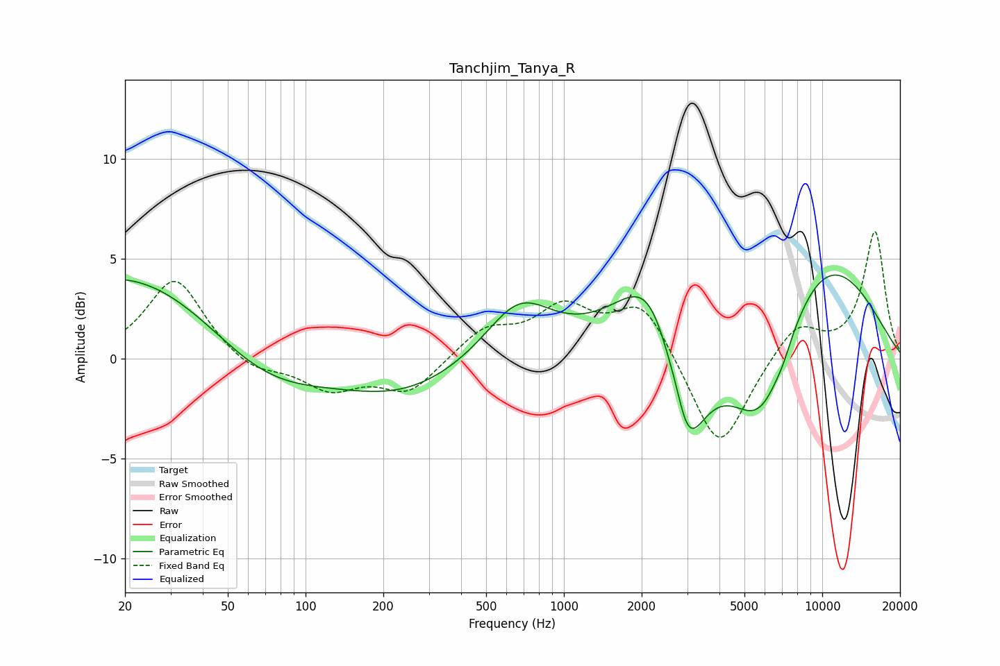

# Tanchjim_Tanya_R
See [usage instructions](https://github.com/jaakkopasanen/AutoEq#usage) for more options and info.

### Parametric EQs
Apply preamp of -4.3 dB when using parametric equalizer.

|   # | Type    |   Fc (Hz) |    Q |   Gain (dB) |
|-----|---------|-----------|------|-------------|
|   1 | Peaking |        69 | 0.39 |        -9.6 |
|   2 | Peaking |        70 | 0.18 |        11.2 |
|   3 | Peaking |       235 | 0.44 |        -6.2 |
|   4 | Peaking |       670 | 1.1  |         2.8 |
|   5 | Peaking |      2319 | 1.03 |         7.4 |
|   6 | Peaking |      2777 | 3.16 |         3.1 |
|   7 | Peaking |      2872 | 1.66 |       -11.8 |
|   8 | Peaking |      5834 | 0.96 |        -7.7 |
|   9 | Peaking |      7045 | 5    |        -0.3 |
|  10 | Peaking |      8608 | 0.46 |         6.9 |

### Fixed Band EQs
When using fixed band (also called graphic) equalizer, apply preamp of **-6.4 dB** (if available) and set gains manually with these parameters.

|   # | Type    |   Fc (Hz) |    Q |   Gain (dB) |
|-----|---------|-----------|------|-------------|
|   1 | Peaking |        31 | 1.41 |         4.1 |
|   2 | Peaking |        62 | 1.41 |        -0.8 |
|   3 | Peaking |       125 | 1.41 |        -1.5 |
|   4 | Peaking |       250 | 1.41 |        -1.7 |
|   5 | Peaking |       500 | 1.41 |         1.4 |
|   6 | Peaking |      1000 | 1.41 |         2.3 |
|   7 | Peaking |      2000 | 1.41 |         2.8 |
|   8 | Peaking |      4000 | 1.41 |        -4.8 |
|   9 | Peaking |      8000 | 1.41 |         1.8 |
|  10 | Peaking |     16000 | 1.41 |         6.3 |

### Graphs

