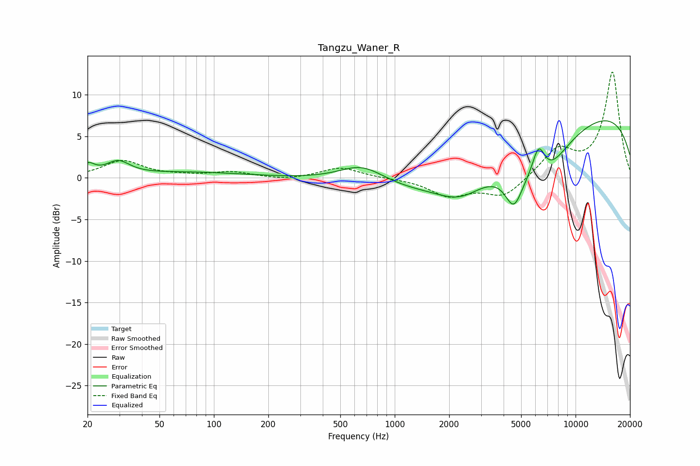

# Tangzu_Waner_R
See [usage instructions](https://github.com/jaakkopasanen/AutoEq#usage) for more options and info.

### Parametric EQs
Apply preamp of -7.0 dB when using parametric equalizer.

|   # | Type    |   Fc (Hz) |    Q |   Gain (dB) |
|-----|---------|-----------|------|-------------|
|   1 | Peaking |        20 | 4.01 |         1.2 |
|   2 | Peaking |        29 | 2.19 |         1.7 |
|   3 | Peaking |        75 | 0.47 |         0.6 |
|   4 | Peaking |       662 | 1.1  |         2.3 |
|   5 | Peaking |      2309 | 1.11 |        -2.3 |
|   6 | Peaking |      3112 | 0.27 |        -4.8 |
|   7 | Peaking |      4549 | 2.91 |        -4.1 |
|   8 | Peaking |      6250 | 3.67 |         4.2 |
|   9 | Peaking |      6598 | 1.11 |        -4.5 |
|  10 | Peaking |      9460 | 0.19 |         9.1 |

### Fixed Band EQs
When using fixed band (also called graphic) equalizer, apply preamp of **-12.8 dB** (if available) and set gains manually with these parameters.

|   # | Type    |   Fc (Hz) |    Q |   Gain (dB) |
|-----|---------|-----------|------|-------------|
|   1 | Peaking |        31 | 1.41 |         2   |
|   2 | Peaking |        62 | 1.41 |         0.2 |
|   3 | Peaking |       125 | 1.41 |         0.7 |
|   4 | Peaking |       250 | 1.41 |        -0.3 |
|   5 | Peaking |       500 | 1.41 |         1.3 |
|   6 | Peaking |      1000 | 1.41 |        -0   |
|   7 | Peaking |      2000 | 1.41 |        -2.1 |
|   8 | Peaking |      4000 | 1.41 |        -2.3 |
|   9 | Peaking |      8000 | 1.41 |         3.3 |
|  10 | Peaking |     16000 | 1.41 |        12.7 |

### Graphs

