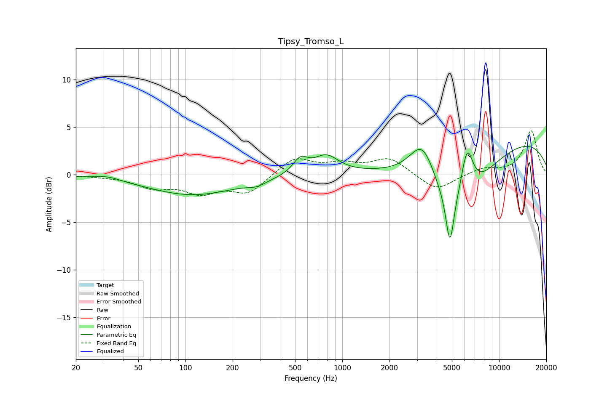

# Tipsy_Tromso_L
See [usage instructions](https://github.com/jaakkopasanen/AutoEq#usage) for more options and info.

### Parametric EQs
Apply preamp of -3.1 dB when using parametric equalizer.

|   # | Type    |   Fc (Hz) |    Q |   Gain (dB) |
|-----|---------|-----------|------|-------------|
|   1 | Peaking |        32 | 1.92 |         0.4 |
|   2 | Peaking |       111 | 0.49 |        -2.1 |
|   3 | Peaking |       285 | 2.47 |        -0.5 |
|   4 | Peaking |       540 | 2.99 |         1.6 |
|   5 | Peaking |       791 | 1.78 |         1.9 |
|   6 | Peaking |      3260 | 1.68 |         4.6 |
|   7 | Peaking |      4857 | 5.68 |        -5.2 |
|   8 | Peaking |      5271 | 0.72 |        -7.8 |
|   9 | Peaking |      6247 | 3.41 |         5.3 |
|  10 | Peaking |      9780 | 0.22 |         4.3 |

### Fixed Band EQs
When using fixed band (also called graphic) equalizer, apply preamp of **-4.7 dB** (if available) and set gains manually with these parameters.

|   # | Type    |   Fc (Hz) |    Q |   Gain (dB) |
|-----|---------|-----------|------|-------------|
|   1 | Peaking |        31 | 1.41 |        -0.1 |
|   2 | Peaking |        62 | 1.41 |        -1.2 |
|   3 | Peaking |       125 | 1.41 |        -1.7 |
|   4 | Peaking |       250 | 1.41 |        -1.9 |
|   5 | Peaking |       500 | 1.41 |         1.8 |
|   6 | Peaking |      1000 | 1.41 |         1   |
|   7 | Peaking |      2000 | 1.41 |         1.7 |
|   8 | Peaking |      4000 | 1.41 |        -1.7 |
|   9 | Peaking |      8000 | 1.41 |         0.7 |
|  10 | Peaking |     16000 | 1.41 |         4.6 |

### Graphs

