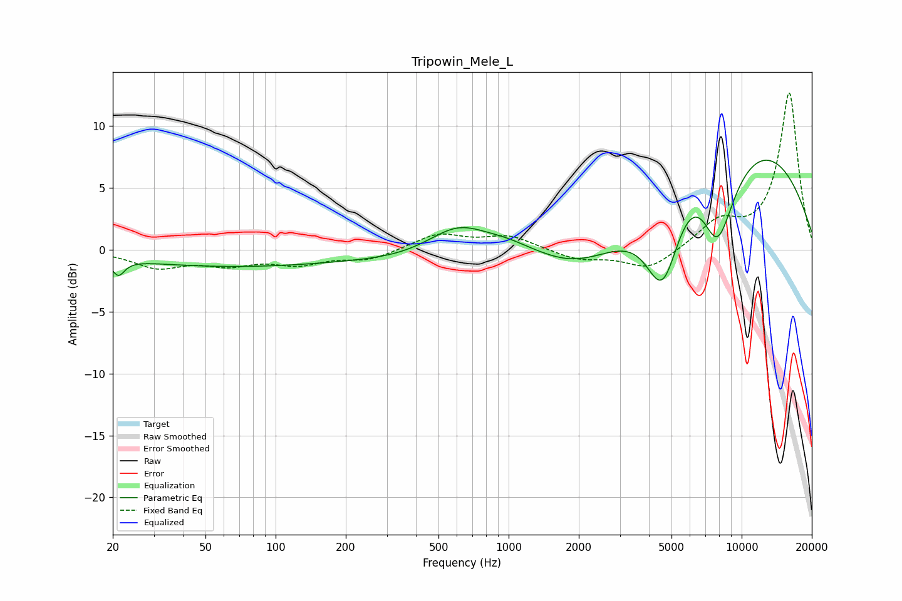

# Tripowin_Mele_L
See [usage instructions](https://github.com/jaakkopasanen/AutoEq#usage) for more options and info.

### Parametric EQs
Apply preamp of -7.3 dB when using parametric equalizer.

|   # | Type    |   Fc (Hz) |    Q |   Gain (dB) |
|-----|---------|-----------|------|-------------|
|   1 | Peaking |        21 | 5.44 |        -1.3 |
|   2 | Peaking |        63 | 0.3  |        -1.3 |
|   3 | Peaking |       615 | 0.94 |         4   |
|   4 | Peaking |       989 | 1.09 |         2.1 |
|   5 | Peaking |      1371 | 1.07 |         1.1 |
|   6 | Peaking |      2155 | 0.29 |        -9.2 |
|   7 | Peaking |      4588 | 1.79 |        -7.9 |
|   8 | Peaking |      6929 | 0.37 |        20   |
|   9 | Peaking |      7870 | 1.27 |       -13.6 |
|  10 | Peaking |      8167 | 1.99 |         0.7 |

### Fixed Band EQs
When using fixed band (also called graphic) equalizer, apply preamp of **-12.8 dB** (if available) and set gains manually with these parameters.

|   # | Type    |   Fc (Hz) |    Q |   Gain (dB) |
|-----|---------|-----------|------|-------------|
|   1 | Peaking |        31 | 1.41 |        -1.3 |
|   2 | Peaking |        62 | 1.41 |        -1   |
|   3 | Peaking |       125 | 1.41 |        -1   |
|   4 | Peaking |       250 | 1.41 |        -0.8 |
|   5 | Peaking |       500 | 1.41 |         1.3 |
|   6 | Peaking |      1000 | 1.41 |         1.1 |
|   7 | Peaking |      2000 | 1.41 |        -0.8 |
|   8 | Peaking |      4000 | 1.41 |        -1.6 |
|   9 | Peaking |      8000 | 1.41 |         2.1 |
|  10 | Peaking |     16000 | 1.41 |        12.7 |

### Graphs

