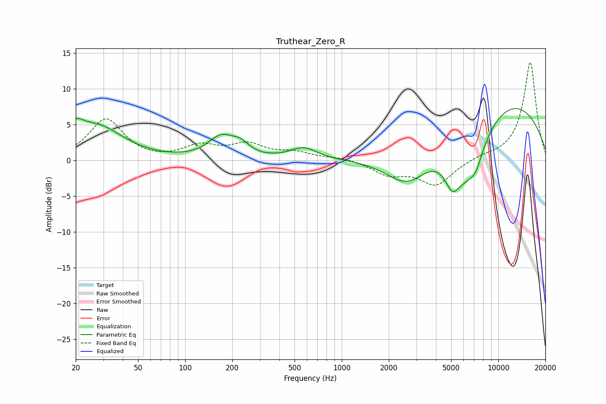

# Truthear_Zero_R
See [usage instructions](https://github.com/jaakkopasanen/AutoEq#usage) for more options and info.

### Parametric EQs
Apply preamp of -7.3 dB when using parametric equalizer.

|   # | Type    |   Fc (Hz) |    Q |   Gain (dB) |
|-----|---------|-----------|------|-------------|
|   1 | Peaking |        20 | 2.93 |         2.3 |
|   2 | Peaking |        27 | 0.87 |         4.6 |
|   3 | Peaking |       171 | 1.7  |         3   |
|   4 | Peaking |       227 | 2.72 |         1.3 |
|   5 | Peaking |       571 | 1.65 |         1.7 |
|   6 | Peaking |      2639 | 0.96 |        -5.2 |
|   7 | Peaking |      5085 | 2.86 |        -3.8 |
|   8 | Peaking |      6430 | 1.16 |        -7.9 |
|   9 | Peaking |      7248 | 3.22 |        -1.5 |
|  10 | Peaking |     10000 | 0.29 |         9.1 |

### Fixed Band EQs
When using fixed band (also called graphic) equalizer, apply preamp of **-13.8 dB** (if available) and set gains manually with these parameters.

|   # | Type    |   Fc (Hz) |    Q |   Gain (dB) |
|-----|---------|-----------|------|-------------|
|   1 | Peaking |        31 | 1.41 |         5.7 |
|   2 | Peaking |        62 | 1.41 |        -0.2 |
|   3 | Peaking |       125 | 1.41 |         1.8 |
|   4 | Peaking |       250 | 1.41 |         2   |
|   5 | Peaking |       500 | 1.41 |         1   |
|   6 | Peaking |      1000 | 1.41 |         0.4 |
|   7 | Peaking |      2000 | 1.41 |        -1.9 |
|   8 | Peaking |      4000 | 1.41 |        -3.4 |
|   9 | Peaking |      8000 | 1.41 |         0.4 |
|  10 | Peaking |     16000 | 1.41 |        13.8 |

### Graphs

