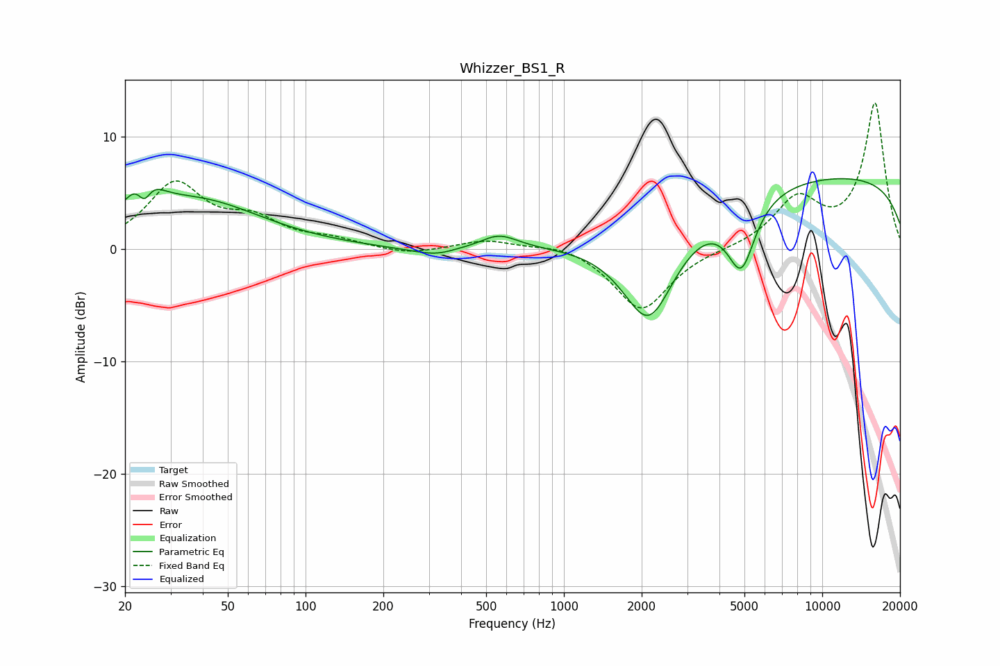

# Whizzer_BS1_R
See [usage instructions](https://github.com/jaakkopasanen/AutoEq#usage) for more options and info.

### Parametric EQs
Apply preamp of -6.4 dB when using parametric equalizer.

|   # | Type    |   Fc (Hz) |    Q |   Gain (dB) |
|-----|---------|-----------|------|-------------|
|   1 | Peaking |        23 | 2.64 |         4.2 |
|   2 | Peaking |        24 | 5.13 |        -3   |
|   3 | Peaking |        38 | 0.56 |         4.2 |
|   4 | Peaking |       344 | 1.35 |        -1.1 |
|   5 | Peaking |       380 | 2.15 |         0.4 |
|   6 | Peaking |       558 | 1.85 |         1.4 |
|   7 | Peaking |      2134 | 1.32 |        -8.9 |
|   8 | Peaking |      4833 | 2.33 |        -4.5 |
|   9 | Peaking |      4901 | 3.42 |        -1.6 |
|  10 | Peaking |     10000 | 0.18 |         6.6 |

### Fixed Band EQs
When using fixed band (also called graphic) equalizer, apply preamp of **-13.1 dB** (if available) and set gains manually with these parameters.

|   # | Type    |   Fc (Hz) |    Q |   Gain (dB) |
|-----|---------|-----------|------|-------------|
|   1 | Peaking |        31 | 1.41 |         5.7 |
|   2 | Peaking |        62 | 1.41 |         2.2 |
|   3 | Peaking |       125 | 1.41 |         0.7 |
|   4 | Peaking |       250 | 1.41 |        -0.5 |
|   5 | Peaking |       500 | 1.41 |         0.8 |
|   6 | Peaking |      1000 | 1.41 |         0.6 |
|   7 | Peaking |      2000 | 1.41 |        -5.5 |
|   8 | Peaking |      4000 | 1.41 |         0   |
|   9 | Peaking |      8000 | 1.41 |         4.2 |
|  10 | Peaking |     16000 | 1.41 |        12.9 |

### Graphs

